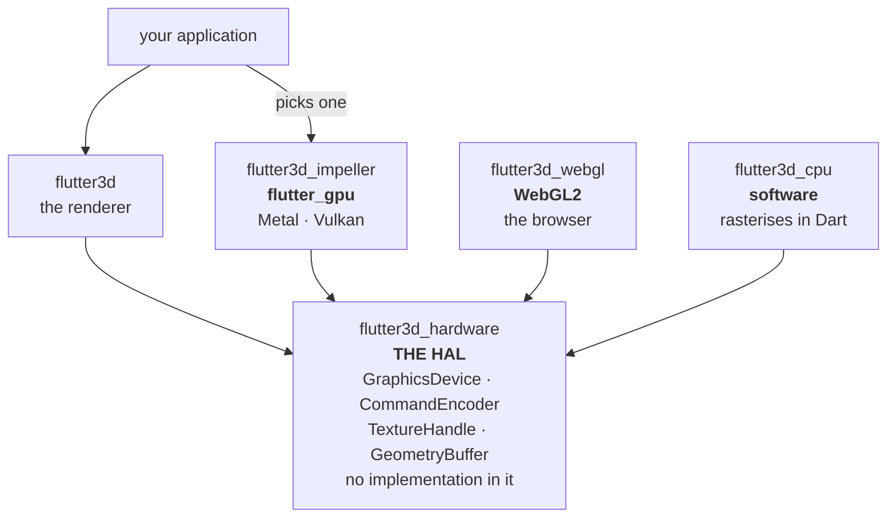
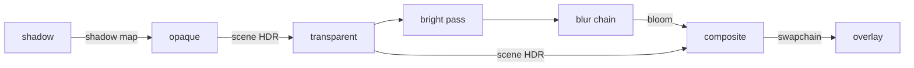

# Architecture

Four rules, each enforced by a test instead of by intention, and one consequence of the platform that shapes everything downstream of it.

## The rules

### The engine names no graphics API — the HAL {#the-hal}

`flutter3d` depends on `flutter3d_hardware` and nothing below it. That package is the **HAL**: the hardware abstraction layer, and the vocabulary the engine is written against. It contains no implementation at all, a backend implements it, the engine talks to it, and neither has to know about the other.



An application names a backend in its pubspec and hands the device to `Renderer.create`. That is the one line that changes to move a game onto another API, and the reason the choice stays visible in the pubspec instead of being resolved by magic.

```dart
final device = await GpuRenderBackend.create();   // flutter3d_impeller
final renderer = Renderer.create(device: device);
```

### The three backends

| Backend | Runs on | Entry point | Status |
|---|---|---|---|
| **`flutter3d_impeller`** | `flutter_gpu` — Metal on Apple platforms, Vulkan elsewhere | `GpuRenderBackend.create()` | The production one. Everything in these docs runs on it |
| **`flutter3d_webgl`** | WebGL2, in the browser | `WebGlDevice` | Runs the shooter and the platformer. Slower, at a fixed resolution |
| **`flutter3d_cpu`** | Nothing. It rasterises in Dart | `CpuDevice()` | Complete for the golden set. A dev dependency of every game |

Each exists for a different reason, and none of them is a fallback for another.

**`flutter3d_impeller`** is the real one. Nothing else in the stack names `flutter_gpu`, which is the property that package exists to hold.

**`flutter3d_webgl`** is how you find out whether the HAL is a seam or a description of Impeller. A fake backend can only confirm that an interface is *callable*, never that it is *implementable*. Two of the three games run on it, at a fixed internal resolution and a lower frame rate; [the platformer](/platformer/demo/) and [the shooter](/shooter/demo/) are embedded in these docs. [The racing game](/racing/demo/) renders and is too slow to drive, which is an open problem rather than a portability one.

Its shaders are GLSL ES 3.00 generated from `flutter3d_shaders`, and nothing checks that the generated file is current. That is the same bargain the compiled Impeller bundle makes, and it has already cost one silent failure.

**`flutter3d_cpu`** is the one that makes the agreement mean something. Two hardware backends agreeing proves less than it looks like: both are driven by a C API and both rasterise on a GPU, so an assumption shared by graphics hardware would be invisible to the pair of them. This one shares nothing with either, no driver, no shading language, no command buffer. It is also what makes thirty golden scenes checkable in a headless run, and what caught three bugs that every simulation test passed.

Any new backend has to pass `flutter3d_conformance` before it counts as one.

<div class="note">
<p>Writing a fourth one is a documented job rather than an archaeology exercise: <a href="/core/backends/"><strong>Writing a HAL backend</strong></a> covers the whole contract, the ten semantics that appear in no signature, the conformance suite you can run before compiling a single shader, and the twenty-six shader entry points your bundle has to answer to.</p>
</div>

### What the HAL actually names

```dart
abstract interface class GraphicsDevice implements TextureAllocator {
  PipelineHandle createPipeline(...);
  GeometryBuffer uploadGeometry(ByteData bytes, GeometryUsage usage);
  TextureHandle? createTextureFromPixels({...});

  void beginFrame();
  CommandEncoder beginRenderPass(RenderPassDescriptor descriptor);

  /// Hands the finished frame to Flutter. `present` instead of an image,
  /// because a backend whose frame is composited elsewhere has none.
  Widget present(...);

  Future<ByteData?> readPixels(TextureHandle texture);
}
```

Plus `PassEncoder` (state, bindings, draws), `PassState` as one value, the enums a caller has to name (`formats.dart`, `vertex_layout_spec.dart`), opaque handles for the things a backend owns (`GeometryBuffer`, `ShaderHandle`, `TextureHandle`), sampling (`SamplerOptions`, `MipChain`), and a render target pool with the description that makes two targets interchangeable.

Two rules in `tool/structure.dart` hold the boundary: `the hardware layer names no graphics API` refuses a `flutter_gpu` import anywhere in the HAL, and `the engine names no backend` refuses one in `flutter3d` — and refuses the *dependency* too, which the import scan alone would miss. The HAL also refuses `dart:ui`, apart from one member on `GraphicsDevice` that has to name it, and the reason is written beside the exemption.

<div class="note">
<p>The compiled shader bundle is still an asset of <code>flutter3d</code>, and that is a known wrinkle rather than a decision. A bundle is one backend's output, so it belongs with the backend that reads it; the GLSL it is built from is shared in <code>flutter3d_shaders</code>. Moving it is a question about where shader sources live, worth answering on its own rather than as a side effect.</p>
</div>

<div class="why">
<p>When a second backend arrives, <code>flutter3d_hardware</code> does not change. A translation file appears in the new backend, and that is all. That is the test of whether a layer is an abstraction or a description of its first implementation, and it is why the CPU backend was written before anyone needed software rendering.</p>
</div>

### The game layer does not depend on the renderer

`flutter3d_game` imports Flutter in exactly one file — `src/input/desktop_input.dart`, because a key event is a Flutter type. Everything else is plain Dart over `vector_math`. `flutter3d_physics` imports nothing at all.

Simulation, input and collision have nothing to say about how a frame is drawn, and the bugs they have are invisible in a screenshot. All of them are reachable from a plain unit test, and all of them have been caught by one.

### A genre is a package

`flutter3d_game_shooter` holds what only a shooter wants: monsters, weapons, an inventory, pickups, and the order a shooter's step runs in. A platformer inherits none of it.

This was not free. `Monster` and `MonsterSystem` lived in the game layer for a while, which meant the engine knew what an alert pause was, that attacking involves a weapon, and that being hurt involves a chance of flinching. A platformer has none of those, and the first thing that would have happened when one was written is that half the file would have been unusable and the other half copied.

What stayed behind is machinery: `Actor` (a body, a brain and some health, **every part optional**), `ActorSystem`, `Mechanism`, the level format, the ECS. What left is vocabulary.

<div class="why">
<p>The file used to be <code>lib/shooter.dart</code> in the game package, unexported by the barrel, a rule instead of a boundary. It still resolved from inside the package, and the four things it leaned on carried no marking at all. The genre rule is what turned the rename into a fact.</p>
</div>

### One package may see both sides {#the-bridge}

Level geometry has to become mesh nodes. An actor has to get a visual. A glowing fixture has to drive a light. Neither of the two rules above leaves anywhere for that mapping to live, so `flutter3d_bridge` is that place, and it is the smallest package in the repository.

Everything in it is mechanism. What a torch *looks* like and what colour a runner is are decided by the game and handed in through `FixtureAppearance` and `ActorAppearance`.

```dart
final visuals = ActorVisuals(
  scene,
  appearance: const DungeonMonsters(),  // your game's opinion
  device: device,
);
loaded.level.spawnInto(
  SpawnContext(
    world: loaded.collision,
    actors: actors,
    mechanisms: mechanisms,
    onActorSpawned: visuals.add,   // the bridge, hooked in
    onFixture: fixtures.add,
  ),
  registry: kinds,
);
```

## The consequence: shaders are built ahead of time

There is no runtime shader compilation on this platform. `tool/build_shaders.sh` calls `impellerc` and produces a bundle; the application loads it as an asset. Everything below follows from that one fact.

- **A material graph is impossible.** No `NodeMaterial`, no TSL. Every lighting model is a separate pre-built shader.
- **Every shader is a separate `RenderPipeline`**, so a pipeline switch is the most expensive state change in a pass. That is why it is the high-order key when the render list is sorted.
- **Lighting is a uniform array, not a permutation per light count.** `vec4 lights[8]` with the count as a uniform, so switching a light on or off never rebuilds a pipeline. A capture with three lights and one with a single light both report **one** pipeline.
- **The bundle grows with every permutation** — 12.5 KB with one shader, 97 KB with seven.
- **A shared GLSL header** (`shaders/lib/surface.glsl`) guarantees an identical uniform block across permutations, and the engine tolerates missing members: a shader that never reads `light_direction` loses it from reflection entirely.

<div class="warn">
<p>Declaring a uniform block and never reading it is not harmless. Reflection still reports the block at a non-zero size while the compiled Metal function binds no buffer for it, and binding that phantom block is a <code>SIGSEGV</code> with no Dart stack trace. That is why <code>LightingModel</code> carries explicit metadata (<code>usesFragInfo</code>, <code>usesMaterialMaps</code>, <code>usesMetallicRoughnessMap</code>) rather than the engine inferring anything from a shader's size, and why the header is split into <code>lib/color.glsl</code> and <code>lib/surface.glsl</code>.</p>
</div>

## A material is a pipeline

Because of the above, `Material.lighting` is not a style setting. It selects the fragment shader, and therefore the pipeline, and therefore where the draw lands in the sort.

```dart
Material(
  name: 'brass',
  lighting: LightingModel.pbr,      // <- picks the shader
  baseColor: Vector4(0.7, 0.5, 0.2, 1.0),
  metallic: 1.0,
  roughness: 0.35,
);
```

| Model | Reads the material block | Samples albedo | Samples the full map set |
|---|---|---|---|
| `LightingModel.unlit` | no | yes | no |
| `LightingModel.lambert` | yes | yes | no |
| `LightingModel.blinnPhong` | yes | yes | yes |
| `LightingModel.pbr` | yes | yes | yes |
| `LightingModel.toon` | yes | yes | no |
| `LightingModel.normals` | no | no | no |

## Where the frame graph fits

The renderer does not hardcode a list of passes. `FrameGraph` takes nodes that declare what they read and write, and compiles an order — culling anything nothing consumes, and reporting when a resource is last used so a pool can hand its target to somebody else.



Reading it as data rather than as a call sequence is what makes two things possible: a pass that nobody reads from is not encoded at all, and a render target whose last reader has run can be recycled inside the same frame.

## Extending without forking

Two seams exist for adding to a frame without editing the renderer.

**`PassContributor`** draws inside an existing pass. The particle system is one — `renderer.addContributor(ParticleContributor(particles))`, and nothing in `flutter3d` names a particle as a result.

```dart
final particles = ParticleSystem(capacity: 2000);
renderer.addContributor(ParticleContributor(particles));
```

**`EntityKind`** adds a noun to the level format. Both games' entire vocabularies are kinds, and the same registry validates a document and spawns it, so the two cannot disagree about what a level may contain.

## Next

- [The frame](/core/rendering/): what each of those passes actually does
- [Geometry & materials](/core/geometry/): what a pipeline is drawing
- [Pitfalls](/reference/pitfalls/): the platform conditions behind several of these decisions
