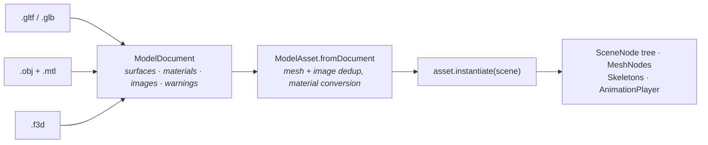

# Assets & animation

Three decoders, one abstraction, one upload path. Decoding runs on a background isolate; nothing in the decoding layer names `flutter_gpu`, `dart:io` or `dart:ui`.

## One abstraction, three formats

Both decoders, and the binary container — emit the same `ModelDocument`: a list of `ModelSurface`, a list of `SurfaceMaterial`, a list of `EncodedImage`, and `warnings`.



That is what makes `ModelAsset.fromDocument` the single upload path, and it means adding a fourth format is a matter of writing a decoder rather than touching the loader.

## Loading a model

```dart
final document = await decodeModelInIsolate(
  ModelLoadRequest(source: const BundleAssetSource('assets/models/hero.glb')),
);

final asset = await ModelAsset.fromDocument(
  document,
  device: device,
  name: 'hero',
);

final instance = asset.instantiate(scene, name: 'runner');
final player = instance.player;          // null when the file has no clips
```

| Source | Where the bytes come from |
|---|---|
| `BundleAssetSource` | The Flutter asset bundle |
| `FileAssetSource` | The filesystem. Unavailable on web, which is why it is a separate type instead of a flag |

<div class="warn">
<p><strong>File reads stay on the UI isolate.</strong> <code>BackgroundIsolateBinaryMessenger.ensureInitialized(token)</code> grants a background isolate a working channel but creates no <code>ServicesBinding</code>, and <code>rootBundle</code> resolves through <code>ServicesBinding.instance</code>. Routing <code>flutter/assets</code> by hand fails deeper still — Flutter's own reply handler throws on a cast. So sibling files are requested back over a port, and the decode is what runs on the isolate.</p>
</div>

### Do not await a model before the first frame

```dart
// A box now, the model when it arrives.
final placeholder = _boxRunner(device, scene, runner);
unawaited(_dressRunner(device, scene, runner));   // swaps it in later
```

<div class="warn">
<p>Putting a model in the scene before the renderer has ever built its frame targets is an arrangement that fails to allocate on some machines, every frame, from the first, with an error screen instead of a picture. Load asynchronously and swap. The engine's own <code>FixtureVisuals</code> does exactly this, and it is why a level is playable while its models are still arriving.</p>
</div>

## glTF 2.0 / GLB

| | |
|---|---|
| Containers | `.glb` (chunk parser with padding, unknown chunks ignored) and `.gltf` |
| Buffers | The GLB `BIN` chunk, base64 `data:` URIs, external files through a resolver |
| Accessors | Every `componentType`, `byteStride` (interleaved), `normalized` with the symmetric clamp for signed types, sparse, and accessors with no bufferView |
| Topologies | TRIANGLES; STRIP and FAN are rewritten as lists, so no pipeline permutation per topology |
| Attributes | POSITION, NORMAL, TEXCOORD_0, TANGENT, COLOR_0 — only those the target layout declares are read |
| Normals | An absent NORMAL produces **flat** normals, as the spec requires, which de-indexes the mesh |
| Tangents | TANGENT when present, otherwise generated with Lengyel's method |
| Node graph | `matrix` and TRS, accumulated transforms, meshes reused across nodes, cycle guard |
| Materials | Metal-rough, all texture slots, `alphaMode`/`cutoff`, `doubleSided`, `KHR_materials_unlit`, `KHR_materials_emissive_strength` |
| Mirroring | Detected from the determinant's sign; winding is flipped per instance |
| Skins | `joints`, `inverseBindMatrices`, `skeleton`, JOINTS_0/WEIGHTS_0 |
| Animations | All samplers and channels; STEP, LINEAR, CUBICSPLINE; translation, rotation, scale, and weights (decoded, not applied) |

Not supported: morph targets, cameras, Draco and meshopt, KTX2, TEXCOORD_1 and up. All of them are reported in `warnings` rather than failing the file, and the demo surfaces those, a skipped primitive explains a model that looks odd but still loaded.

<div class="note">
<p>The node hierarchy is kept <strong>index-aligned with the file</strong>, transform-only nodes included, because animation channels address nodes by index. Rebuilding the hierarchy on instantiation is what lets an animated parent carry its subtree.</p>
</div>

## Wavefront OBJ

| | |
|---|---|
| Faces | `v`, `v/vt`, `v//vn`, `v/vt/vn`; negative indices; polygons fanned into triangles |
| Vertices | Deduplicated by the (position, UV, normal) triple — the unit OBJ actually addresses |
| Normals | With no `vn`, **smooth** (area-weighted) normals are generated. `flat` and `none` are also available |
| UVs | V is flipped by default — OBJ texture space has its origin at the bottom left |
| Groups | `g`, `o` and `usemtl` start a new surface, so a multi-material file yields several draws |
| Materials | `.mtl` through a resolver: `newmtl`, `Kd`, `Ks`, `Ns`, `d`, `Tr`, `map_Kd` |
| Robustness | Unknown directives, malformed faces and missing libraries go to `warnings` |

OBJ predates PBR, so its parameters are **explicitly approximated**: `Kd` becomes base colour, the Phong exponent `Ns` becomes roughness, and a bright neutral `Ks` is the only hint of metalness available. The approximation is documented in `MtlMaterial` rather than hidden.

<div class="note">
<p>Flipped V is the single most common cause of upside-down textures on OBJ imports, and generating smooth normals rather than flat ones matters more than it sounds: the format prescribes nothing, files routinely omit them, and the geometry they omit them for is curved. Flat normals on a teapot look broken.</p>
</div>

## The `.f3d` container

The format matters far more than the language. The same geometry is about **360× slower** to load as OBJ text than as a binary buffer, and native code does not close that gap — measured in `ARCHITECTURE.md` §14. So `.f3d` moves the parse off the device entirely.

```bash
dart run tool/convert_asset.dart ../flutter3d_samples/assets/teapot.obj \
  -o ../flutter3d_samples/assets/f3d/teapot.f3d
```

| teapot | load |
|---|---|
| OBJ — parse, dedup, smooth normals | 4.54 ms |
| `.f3d`, every array touched | 1.1 µs |

Vertex and index arrays are stored exactly as `MeshData` holds them, so loading builds `Float32List.view`s over the file rather than copies, every blob entry is 4-byte aligned precisely so those views are legal. A **section directory** rather than fixed header fields, so a reader skips a kind it does not know and the version only changes when an existing record does.

`F3dDocument` is a `ModelDocument`, so `ModelAsset.fromDocument`, the cache and instancing are all unchanged. The converter re-reads what it wrote and compares it against the source before reporting success.

<div class="note">
<p>The file is <em>larger</em> than its source — 102 KB against 69 KB for the teapot, because indices stay 32-bit and nothing is compressed. That is the trade: narrowing indices or deflating the blob would reintroduce the per-load work the format exists to remove.</p>
</div>

## The resource cache

Reference-counted, so a mesh shared by forty torches is uploaded once and freed when the last one lets go.

```dart
final handle = await cache.acquire('assets/models/torch.glb');
final asset = handle.value;
// ...
handle.release();

cache.evictUnused();
```

A cache belongs to whoever built it — normally one level load. A GPU resource that outlives the level owning it is a leak nobody notices.

## Animation

```dart
final player = instance.player;
if (player != null) {
  player.playNamed('run');
  player.crossFadeToNamed('jump', duration: 0.06);
  player
    ..speed = 1.4
    ..update(dt);
}
```

| | |
|---|---|
| Interpolations | STEP, LINEAR and CUBICSPLINE with authored tangents |
| Rotations | Slerped |
| Modes | Once, loop, ping-pong |
| Transport | `play`, `pause`, `stop`, `seek(seconds)`, `speed` |
| Blending | `crossFadeTo(index)` and `crossFadeToNamed(name)` |

<div class="why">
<p>A crossfade duration is not one number. A quarter of a second blending into a take-off is a quarter of a second of the character still standing there while the body is already in the air, so a jump gets 0.06 s and a walk-to-run gets 0.14 s. The rule is that the fade must be shorter than the event it is covering.</p>
</div>

### Animation is presentation, not simulation

Advance the player **once a frame**, not once a step. The simulation runs at a fixed 60 Hz and the animation should run at whatever the display does. Which clip to play is a pure function of the simulation's state, which makes it testable on its own:

```dart
// A pure function, tested as one.
final wanted = RunnerClips.forRunner(runner);
if (wanted != current) {
  player.crossFadeToNamed(wanted, duration: wanted == RunnerClips.jump ? 0.06 : 0.14);
  current = wanted;
}
player
  ..speed = RunnerClips.rateFor(wanted, groundSpeed)
  ..update(dt);
```

## Skinning

A glTF skin decodes into a `Skeleton` of ordinary scene nodes. 64 joint matrices in a uniform array, four weights a vertex, a separate skinned vertex stage, because a second layout is a second shader, and bounds taken from the **posed** skeleton rather than the bind pose.

## Next

- [Simulation layer](/core/simulation/): the fixed step the animation is not tied to
- [Scene graph](/core/scene/), where an instantiated model lands
- [Tutorial: first scene](/core/tutorial/): loading a model end to end
