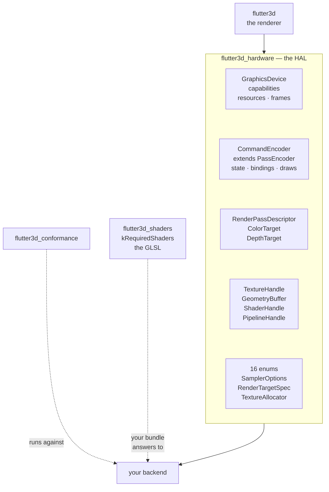

# Writing a HAL backend

`flutter3d_hardware` is a hardware abstraction layer with no implementation in it. This page is what you need to write a fourth one.

The claim it makes is that a backend can be written **without reading the engine**. That claim has been half-tested and half-confirmed: `flutter3d_cpu` is a software rasteriser with no GPU, no driver and no shading language under it, and `GraphicsDevice` was implementable straight from the contract — `Renderer` started against it unmodified and the `plain` parity fixture came out within a mean of 0.56 of Impeller's. Nothing in the engine turned out to assume a GPU.

What could **not** be written from the contract is the shaders. That limit is real, it was named in advance, and it is [the last section on this page](#the-one-thing-the-hal-cannot-abstract).

<div class="goal">
<ul>
<li>What <code>GraphicsDevice</code>, <code>CommandEncoder</code> and <code>PassEncoder</code> require of you</li>
<li>Ten semantics that are part of the contract and appear in no signature</li>
<li>The conformance suite, and how to run it before you have a single shader</li>
<li>The twenty-six shader entry points your bundle must answer to</li>
</ul>
</div>

## What you are implementing



Everything in that box is promised. Changing any of it breaks a backend, and that is the bar for changing it.

## Start with the capabilities

Six of these are questions, not constants, and the engine asks rather than assuming. **Answer honestly**, a backend that claims something it cannot do produces a correct-looking frame with the wrong content and no error anywhere.

```dart
final class MyDevice implements GraphicsDevice {
  @override
  TextureFormat get defaultColorFormat => TextureFormat.rgba8UNormInt;

  @override
  TextureFormat get defaultDepthStencilFormat => TextureFormat.d32FloatS8UInt;

  /// The engine renders linear HDR and tone maps at the end, so it needs a
  /// colour target with range above one.
  @override
  TextureFormat get hdrColorFormat => TextureFormat.rgba16Float;

  /// Where row zero of a render target is. A shader sampling a texture the
  /// engine drew has to be told.
  @override
  FramebufferOrigin get framebufferOrigin => FramebufferOrigin.topLeft;

  /// The engine builds projections for zeroToOne and corrects at the boundary
  /// for a backend that says otherwise.
  @override
  DepthRange get depthRange => DepthRange.zeroToOne;

  @override
  int get preferredSampleCount => 4;

  @override
  bool get supportsOffscreenMsaa => true;

  @override
  bool get supportsMipmaps => true;

  @override
  bool get supportsWireframe => true;

  /// Taps a sampler may take along a foreshortened axis; 1 for none. A
  /// request above this is clamped by the backend, never refused.
  @override
  int get maxAnisotropy => 16;
}
```

| Query | What answering wrong costs you |
|---|---|
| `hdrColorFormat` | An **incomplete framebuffer**: every draw silently discarded, no error raised, a frame of transparent black, every counter reporting success. WebGL2 accepts `RGBA16F` as a texture format and refuses to render to it until `EXT_color_buffer_float` is asked for, a thing only a backend can know to do |
| `framebufferOrigin` | Maps the lighting pass looks into are flipped. The *picture* is fine, which is what makes it hard to find |
| `depthRange` | Geometry clipped against the near plane, or half of it gone |
| `supportsMipmaps` | Not a slower texture, a **black** one. On OpenGL ES 2 without `GL_APPLE_texture_max_level`, a hand-built chain samples as black |
| `supportsWireframe` | OpenGL ES has no `glPolygonMode`. Filling the triangles instead looks exactly like the wireframe setting having no effect |
| `preferredSampleCount` | One number instead of a boolean, because "does MSAA work" and "how much" are different questions |
| `maxAnisotropy` | The one query whose overshoot is *clamped* rather than refused: `SamplerOptions.anisotropy` above it is lowered to it. Forward it unclamped to WebGL2 and every bind above the ceiling is `INVALID_VALUE`, silently, and the floor is merely blurrier than asked for |

<div class="warn">
<p><strong>Refuse loudly rather than substituting something similar.</strong> Every silent substitution on this list has cost somebody a day, because the failure mode is a plausible picture.</p>
</div>

## Resources

```dart
/// Expensive — it compiles and links. Callers cache, keyed on the *pair*
/// and on the layout: two layouts over one stage pair are two different
/// pipelines, and handing back the first for the second draws a picture
/// while reading instance data as vertices.
///
/// A null [layout] means: work it out from the shader. Passing one is how a
/// pipeline gets a second buffer stepping per instance, because no reflection
/// can tell you which of two buffers that is.
PipelineHandle createPipeline(ShaderHandle vertex, ShaderHandle fragment,
    {VertexLayoutSpec? layout});

/// Geometry that outlives the frame. [usage] is required and cannot be
/// defaulted — see the semantics below.
GeometryBuffer uploadGeometry(ByteData bytes, GeometryUsage usage);

/// One call rather than create-then-write, because that is what every caller
/// means. Null when [pixels] is not the size the device wants, which is how a
/// decoder that disagreed about the dimensions degrades to "no texture"
/// rather than taking the whole model down.
///
/// [mipLevels] are supplied, not generated. WebGL2 has `glGenerateMipmap` and
/// Impeller does not, so letting each backend build its own chain is two
/// backends agreeing by accident and a third answering differently, at a
/// scale nobody would attribute to the filter. `MipChain.build` makes them
/// once, above the seam.
TextureHandle? createTextureFromPixels({
  required int width,
  required int height,
  required TextureFormat format,
  required ByteData pixels,
  List<ByteData>? mipLevels,
});

/// From TextureAllocator, so RenderTargetPool takes the device directly and
/// every texture in the engine is created by one rule.
TextureHandle createTexture(RenderTargetSpec spec);
```

<div class="note">
<p>A <code>GraphicsDevice</code> is <strong>a value, never a global</strong>. flutter_gpu's own device is a singleton and reaching it from a top-level function was how the renderer used to make textures; nothing above the backend does that now. Two things depend on it: a backend cannot be a separate package while the core reaches into it, and a <em>fake</em> backend — the only way a pass's drawing is testable off a device — cannot displace a singleton.</p>
</div>

## Frames and passes

```dart
/// The one member about time rather than resources. Every backend has
/// *something* that rotates: on flutter_gpu it is the ring of per-frame
/// uniform allocators, which cannot be reset in place because `submit` is
/// asynchronous. A backend with nothing to rotate implements this as nothing.
void beginFrame();

/// Opens a pass. The returned encoder must be submitted.
CommandEncoder beginRenderPass(RenderPassDescriptor descriptor);
```

`PassEncoder` is the recording half; `CommandEncoder` adds `submit()`. The split is deliberate, a contributor drawing into somebody else's pass is handed a `PassEncoder`, so passing it an already-submitted pass is a type error rather than a comment warning about one.

```dart
abstract interface class PassEncoder {
  void setViewport(ScreenRect rect);
  void setScissor(ScreenRect rect);
  void setPrimitiveType(PrimitiveType type);
  void setPolygonMode(PolygonMode mode);
  void setCullMode(CullMode mode);
  void setWindingOrder(WindingOrder order);
  void setDepthWrite(bool enabled);
  void setDepthCompare(CompareFunction compare);
  void setBlend(BlendState? state, {int attachment = 0});

  void bindPipeline(PipelineHandle pipeline);
  void bindVertexBuffer(GeometryBuffer buffer, int vertexCount, {int slot = 0});
  void bindVertexData(ByteData bytes, int vertexCount, {int slot = 0});
  void bindIndexBuffer(GeometryBuffer buffer, IndexType type, int indexCount);
  void bindIndexData(ByteData bytes, IndexType type, int indexCount);
  bool bindUniformBlock(...);
  void bindTexture(...);
  void clearBindings();

  void draw({int instanceCount = 1});
}
```

The `*Data` variants are for geometry that lives one frame; `uploadGeometry` is for everything else.

## Presenting, and reading back {#presenting}

```dart
Widget present(TextureHandle frame, {BoxFit fit, FilterQuality quality});
Future<ByteData?> readPixels(TextureHandle texture);
Future<ByteData> readback(TextureHandle texture, {ScreenRect? region});
```

<div class="why">
<p><code>present</code> used to be <code>ui.Image imageOf(...)</code>, and that was an Impeller shape wearing a neutral name. On flutter_gpu a texture becomes a <code>ui.Image</code> for free. A WebGL2 backend has no such path: the only route is <code>readPixels</code> into CPU memory and <code>decodeImageFromPixels</code> back onto the GPU — measured at the golden suite's own 480×360 that is <strong>17.7 ms per frame against a 16.7 ms budget for the whole frame</strong>, and <code>readPixels</code> is 347 µs of it. The cost is putting the pixels <em>back</em>.</p>
<p>So the contract asks for a widget: flutter_gpu wraps its image, a WebGL2 backend hands over the canvas it drew into, and the browser composites it. The cost of that honesty, stated once: on a backend that presents a platform view, the frame cannot be arbitrarily transformed or layered by the widget tree. <code>fit</code> is the part every caller actually used, and both can honour it.</p>
</div>

`readPixels` is a different question with a different cost — it runs when something wants to *look* at what a pass wrote, and returns null for a `deviceTransient` texture, which lives in tile memory and has nothing left to read once the pass has ended.

`readback` is the same bytes asked a third way: **as the passes submitted before the call left them, and without waiting for the GPU.** A pass submitted afterwards, drawing into the same texture, does not reach the answer; and the caller is not held up by a frame the GPU is still on — the future resolves when the queue reports the copy done, which is a frame or two later. That is what an exposure meter reading a luminance target every frame needs, and what an editor reading the id under the cursor needs. On flutter_gpu the copy is texture to texture into a pooled staging texture, since `DeviceBuffer` has no read path back to Dart; on WebGL2 it is `readPixels` into a pixel-pack buffer behind a fence, polled rather than blocked on; the software rasteriser has nothing in flight and answers at once. What cannot be read — tile memory, a multisampled target, a cube, a region past the edge, any format but the two linear eight-bit RGBA layouts — is refused with an `ArgumentError` by `readbackRegionOf`, once, for every backend, and the handle carries every fact needed to ask first. The format is refused rather than converted because the bytes are promised to be the same bytes everywhere, and a half-float target was three answers on three backends — on WebGL2 a `readPixels` the context rejects and a future that completes successfully with a picture of zeros. A float texture is read through `readPixels`, or drawn into an eight-bit target first, which is what the luminance pass is. The sRGB twins of the two layouts are refused as well, and were admitted at first on the grounds of being eight bits per channel: that is the wrong test, because the disagreement is over the encoding rather than the width — one backend reads an sRGB texture as the bytes it stores and another is entitled to decode them to linear on the way out.

flutter_gpu 3.47 also offers a `GpuImageSurface`: a pool of presentable textures that Flutter draws as a `ui.Image`, deciding for itself when one may be drawn into again. `present` does not use it, and the reason is measured rather than assumed. `packages/flutter3d_impeller/tool/surface_probe.sh` runs the same clear-only pass through the renderer's ring of finished frames and through a surface, 240 frames each at 1280×800 with Flutter drawing every one, and prints what each costs.

<div class="why">
<p>Same UI-thread cost — 95–105 µs a frame on every path, 125–160 µs at the 95th percentile, and the spread between runs is wider than the gap between paths — the same 8.3 ms between frames, and no copy on either path: the image is a wrapper over the texture in both. Memory is two points on a scale rather than one number. At four megabytes of short-lived allocation a frame — the probe's churn path — the pool peaks at five textures, some twenty megabytes; with no allocation whatever the same surface reaches forty-seven. Nothing in between was run, and this engine is written to keep a frame from allocating at all, so where a real frame would land is a range and not a figure. Against that, a ring that holds the presented frame back one frame — which is the surface's own guarantee, and the only version of the ring comparable with it — costs two, and nothing in it waits for a collector to say so. The forty-seven is what shows the mechanism: a texture counts as free only once nothing but the surface's own records reference it, and the native halves of the Dart <code>Texture</code>, <code>RenderPass</code> and <code>CommandBuffer</code> a frame makes are references until the collector frees them. The pool is paced by the garbage collector, not the display. <code>resize</code> refuses while a frame is out, and <code>present</code> works through a trailing empty command buffer — so the shape would have fit this backend, at the price of a contract change and at least three more textures for no faster frame. <code>GpuPresentStatus</code> is not among the findings: <code>present</code> returns a constant in the Dart wrapper, so there is nothing there to measure. The probe stays so the numbers can be taken again on a flutter_gpu that counts references some other way; the verdict is ARCHITECTURE §15.</p>
</div>

## The semantics no signature can express {#semantics}

Half of what a backend must *do* is in no signature. These were prose once, which is to say they were unenforced, and three of them were broken in the second backend, each producing a correct-looking frame with the wrong content.

| Rule | What breaks when you get it wrong |
|---|---|
| **A clear covers the whole attachment**, whatever the viewport or scissor say | The point-light atlas clears once and then draws tile by tile. GL does not give this for free — `clearBufferfv` respects `SCISSOR_TEST` |
| **Rectangles are stated from the top left**, matching where row zero of a render target is | A backend whose framebuffer origin is at the bottom must flip them. The engine will not |
| **`readPixels` returns rows from the top**, independently of the above | A caller cannot tell which way round it was handed pixels, and a golden compared against a mirrored frame fails as though rendering broke |
| **`readback` returns the frame before** — the texture as the passes submitted before the call left it, without stalling | A copy made when the driver gets round to it hands an exposure meter the frame *after*; the check clears red, asks, clears blue, and has to get red |
| **A sampler a shader declares must be bound** | Leaving one unbound is a native crash with no Dart frame on at least one backend, which is why the engine binds a stand-in rather than nothing |
| **`bindUniformBlock` returns false for a block the shader does not have** | That case is ordinary, a compiler drops a block nothing reads. A block that exists *without a member the caller named* is an error, because then the two ends disagree about its shape and zeros are a plausible-looking value for most of what goes through there |
| **A null `sampler` means `SamplerOptions.linearRepeat`**, not the constructor's own defaults, which are nearest and clamp | See below. This one cost two percent of every textured golden |
| **`GeometryUsage` is not a hint** | WebGL binds a buffer to its target for life. A buffer uploaded as vertices can never be bound as indices: `INVALID_OPERATION`, the draw is dropped, and the frame comes back the clear colour with nothing logged |
| **`setDepthWrite(false)` means depth writes are off** | See below |
| **Unset `PassState` fields mean *emit nothing*** | What an omitted call means differs per backend, and the omissions in a pass's sequence are load-bearing |
| **Ask before requesting what a backend may not have** | `supportsWireframe`, `supportsOffscreenMsaa`, `depthRange`, `framebufferOrigin`, `hdrColorFormat`, `preferredSampleCount` |

### The sampler default, and why it is written down

The two hardware backends had each chosen `linearRepeat` for a null sampler and therefore agreed **without anybody writing it down**. The third read the contract, took the `SamplerOptions` constructor defaults, and drew hard seams everywhere the others drew soft ones, two percent of every textured golden, looking exactly like a filtering bug in the new backend rather than like a question the contract had never answered.

### `setDepthWrite`, and comparability beating correctness

`flutter_gpu`'s native setter ignored its argument and assigned `true` until SDK 3.47, so on Impeller depth writes could be switched on and never off, and additive particles, which ask for it precisely so they do not occlude each other, occluded each other.

**The software backend mirrored the bug on purpose**, argument and default alike, because an honest implementation put the particle scenes five to ten percent away from the hardware one and a gap that size is loud enough to hide a real regression behind.

<div class="why">
<p>Where a backend has to choose between being <em>right</em> and being <em>comparable</em>, comparable wins, and the choice earns a test that fails the day it stops being necessary. <code>flutter3d_cpu/test/depth_write_test.dart</code> was that test. It was not deleted when the SDK was fixed; one expectation was flipped, so it now proves the opposite of what it used to. Four particle goldens moved on the upgrade and twenty-four other scenes did not, which is how the fix was confirmed to have landed and nothing else with it.</p>
</div>

### Enum value names are load-bearing

The Impeller backend's translation asserts that each enum value maps to the `flutter_gpu` value of the **same name**, which is what catches a mapping that swapped two entries.

## Run the conformance suite first

`flutter3d_conformance` turns those semantics into executable checks, in **two tiers**. `coreChecks` works with clears, uploads and readback alone, so you can run it before you have a single shader compiled, which is when the answers are cheapest to act on. `shaderChecks` needs the bundle — fifteen of them, among which: that a pass starts covering its own attachment and nothing else, that it inherits no clipping from the pass before it, that a binding made for one pipeline does not follow the next, that a block missing a member the caller named is refused, and that a pass renders into a cube face and a mip.

`runDeviceConformance` runs both.

<div class="why">
<p>The library said it was shader-free as a whole for some time after it stopped being true: five of the twelve checks linked stages and drew. A backend written against that promise would have met five failures it could do nothing about yet, which is the opposite of what a conformance suite is for. The suite has grown since — seven checks need nothing but clears, uploads and readback, and the rest need the bundle — and the split is a property of the two lists rather than a sentence anybody has to keep true.</p>
</div>

```dart
import 'package:flutter3d_conformance/flutter3d_conformance.dart';

void main() {
  runDeviceConformance(
    backend: 'my_backend',
    makeDevice: ({required int width, required int height}) =>
        MyDevice(width: width, height: height),
  );
}
```

| Check | What it catches |
|---|---|
| answers every capability query | A getter that throws, or lies |
| the HDR format it names is renderable | The incomplete-framebuffer trap |
| a clear covers the whole attachment | `clearBufferfv` honouring the scissor |
| uploaded pixels keep their row order | Origin confusion, in both directions |
| a buffer is uploaded for its declared use | Treating `GeometryUsage` as a hint |
| the bundle answers to every name the engine asks for | A missing entry point, before it becomes an empty frame |
| a stage pair the engine links does link | A layout the backend cannot honour |
| an instanced draw draws every instance | A second buffer that did not step per instance |

The device factory is called **fresh for each check**, because a backend that leaves state behind should fail on its own account instead of on the previous test's.

<div class="note">
<p>The suite uses its own <code>require</code> rather than <code>expect</code>. <code>flutter_test</code>'s matchers throw <code>OutsideTestException</code> when there is no test running, and one of the two backends cannot run tests at all — Flutter GPU needs Impeller, which a headless <code>flutter test</code> does not enable, so its harness is an application. Written with <code>expect</code>, three of these checks reported a failure that was the harness rather than the backend, and reported it only on the backend that could not use the harness in the first place. <code>conformanceChecks</code> is exposed as plain functions for exactly that case.</p>
</div>

Then run `flutter3d_conformance`'s cross-backend comparison, which has per-scene budgets instead of one global tolerance.

## The one thing the HAL cannot abstract {#the-one-thing-the-hal-cannot-abstract}

**Shader names.** The engine asks for entry points — `MeshVertex`, `Pbr`, `Composite`, and for uniform blocks and members by name. Nothing in any signature says which names, so an implementation written from the interface alone compiles and draws nothing.

```dart
import 'package:flutter3d_shaders/flutter3d_shaders.dart';

for (final RequiredShader shader in kRequiredShaders) {
  // shader.name, shader.fragment
}
```

Twenty-six entry points, generated from the bundle manifest and kept in step with it by a test rather than by discipline:

| Stage | Names |
|---|---|
| Vertex | `MeshVertex`, `MeshSkinnedVertex`, `FullscreenVertex`, `DebugLineVertex`, `ParticleVertex`, `ParticleMeshVertex`, `ShadowTileResetVertex` |
| Lighting | `Unlit`, `Lambert`, `BlinnPhong`, `Pbr`, `Toon`, `Normals` |
| Shadows | `ShadowDepth`, `ShadowDistance`, `ShadowTileReset` |
| Post | `BloomThreshold`, `BloomDownsample`, `BloomUpsample`, `Composite`, `Reflections` |
| Particles | `Particle`, `ParticleTextured`, `ParticleMesh` |
| Debug | `DebugLine`, `MrtProbe` |

`flutter3d_shaders` holds the GLSL every backend compiles from — Impeller into a bundle, WebGL by translation, the CPU backend as Dart transcriptions, so that is one list instead of three. **But a backend cannot satisfy the contract without reading the shaders themselves.**

<div class="warn">
<p>Member names are the sharp edge, and they fail silently in <em>both</em> directions. A shader that asks for a member nobody wrote gets zeros; a caller that names a member the block does not have is an error, because then the two ends disagree about its shape.</p>
<p><code>flutter3d_cpu</code> hit the first of those on its first run. Its shaders were written from a plausible memory of what a renderer's uniforms are called, and they drew an <strong>unlit scene</strong>: <code>light_count</code> does not exist, and <code>material</code> is metallic and roughness rather than the colour. Nothing anywhere reported a problem.</p>
</div>

This is also the limit on extensions. An application that builds its own bundle can add a lighting model today, because `LightingModel` is a value class instead of an enum. An extension that does not control the bundle cannot.

## What is outside the promise

Not because it is unstable, but because nothing outside `flutter3d_hardware` should depend on it.

- Everything in `flutter3d`'s `src/` beyond what `flutter3d.dart` exports.
- `FrameResources` internals. Its rules — versions, `keeps`, release by identity — are engine machinery, and a backend never sees them.
- `RenderServices.encodeScene`. Nine parameters and a caller that must remember to ask the frame for its shadows; the shape that survives is handing it the `NodeFrame`, and that is a change worth making rather than freezing.
- The compiled shader bundle's format and location. It is one backend's build output.

## `PassState`, and the backend nobody has written yet

`PassState` and its `setState` extension are promised, with one thing worth saying: **no backend implements anything for them.** `setState` is an extension over `PassEncoder`, statically dispatched, built only from types already in the contract, so a backend gets it for free and cannot get it wrong.

They live in the HAL rather than in the engine for the backend nobody has written yet: a Vulkan-shaped one has to accumulate rasteriser state and look a pipeline up at `draw()`, and that needs something hashable to accumulate into.

## Two handles worth a second look

- **`TextureHandle` deliberately has no `==`.** The pool lends by identity and the frame releases by identity, and value equality would quietly break both.
- **A handle from one device means nothing to another.** `ShaderLibrary` lives on the device instead of on `RenderServices`, because it is a property of the backend.

## A suggested order

1. Capabilities, honestly. Run the conformance suite — the first two checks pass or fail on these alone.
2. Textures, geometry upload, and `createTexture`. Now the row-order and geometry-usage checks pass.
3. Pass descriptors, clears and `readPixels`. The clear-covers-all check is next.
4. `beginFrame`, the encoder, state and bindings, `draw`. The engine will now run against you and produce a black frame.
5. Read the GLSL in `flutter3d_shaders`. Translate the bundle. Check every entry point in `kRequiredShaders` and every uniform member name against the source, not against memory.
6. `present`, in whatever way your platform actually composites.
7. The parity fixtures, then the golden set with per-scene budgets.

The third backend went through this in that order and confirmed the interesting half of the claim: `GraphicsDevice` was implementable straight from the contract, and step 5 is where the contract stops helping.

## Next

- [Architecture](/core/architecture/#the-hal), where the HAL sits, and what the other rules are
- [The frame](/core/rendering/): what the engine will ask your backend to encode
- [Pitfalls](/reference/pitfalls/): the failure modes, arranged by what you see
- [Testing](/reference/testing/): the two golden sets, and why there are two
