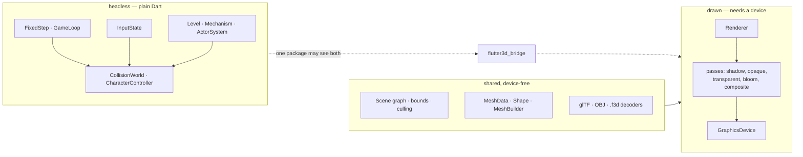

# What core is

Core is everything all three games use and none of them owns. Six packages that never learn what a monster, a coin or a lap is, plus three backends that never learn what a scene is.

Nothing in this section is genre knowledge. That is not a stylistic preference. It is the property that made the second game possible to write, and every page here says which test enforces it.

## The six packages

| Package | What it owns | Depends on |
|---|---|---|
| [`flutter3d`](/core/rendering/) | The renderer, the scene graph, geometry, decoders, animation | `flutter3d_hardware` and nothing below it |
| [`flutter3d_hardware`](/core/architecture/#the-hal) | **The HAL** — devices, encoders, buffers, textures, pipelines, passes. No implementation at all | nothing |
| [`flutter3d_sim`](/core/simulation/) | Fixed step, input, levels and holes in them, mechanisms, actors, navigation and the automap, ECS, snapshots, demos, rewind | `flutter3d_physics`, `vector_math`. Plain Dart, no Flutter |
| `flutter3d_game` | The devices: touch stick and buttons, keyboard and mouse, the gamepad route. Re-exports `flutter3d_sim` | `flutter3d_sim` and Flutter |
| [`flutter3d_physics`](/core/physics/) | Shapes, broadphase, sweeps, rays, character controller, rigid bodies | nothing. Plain Dart |
| [`flutter3d_bridge`](/core/architecture/#the-bridge) | Level geometry to mesh nodes, actor to visual, fixture to light | both sides, and it is the only package allowed to |

**Three backends implement the HAL**, and an application names exactly one of them in its pubspec:

| Backend | Runs on |
|---|---|
| `flutter3d_impeller` | `flutter_gpu` — Metal and Vulkan. The production one |
| `flutter3d_webgl` | WebGL2 in the browser. Runs the shooter and the platformer at a fixed resolution and a lower frame rate |
| `flutter3d_cpu` | Nothing — it rasterises in Dart, so thirty-four golden scenes stay checkable with no GPU in the room |

`flutter3d_conformance` is the suite any fourth one would have to pass, and [Writing a HAL backend](/core/backends/) is the guide for writing that fourth one.

## The two halves, and the line between them

The left half runs under `dart test` on the VM. Its characteristic failures happen once in a thousand steps, so finding them means running thousands of steps in a loop, which is possible because none of it needs a device.

The middle band is the part people expect to need a GPU and does not. Bounds, culling, framing, picking, decoding and draw-call sorting are all arithmetic. The scene layer holds a `MeshGeometry`, not a `GpuMesh`, and requiring a device would have meant none of them could be unit tested.

## What to read, in what order

Each page below stands alone, but this is the order in which each one stops being surprising.

<ul class="cards">
  <li><a href="/core/architecture/">
    01
    <h3>Architecture</h3>
    
The dependency rules, the HAL and its three backends, and the one consequence that shapes everything: shaders are compiled ahead of time.

  </a></li>
  <li><a href="/core/backends/">
    02 · guide
    <h3>Writing a HAL backend</h3>
    
The full contract, the ten semantics no signature can express, the conformance suite, and the shader bundle you cannot avoid writing.

  </a></li>
  <li><a href="/core/rendering/">
    03
    <h3>The frame</h3>
    
Render views, the pass order, instanced batches, precomputed visibility, HDR, bloom, cascaded shadows, fog, reflections, and the frame graph that schedules them.

  </a></li>
  <li><a href="/core/scene/">
    04
    <h3>Scene graph</h3>
    
Nodes with version stamps, cameras and projections, eight lights of any type, the BVH, LOD groups and picking.

  </a></li>
  <li><a href="/core/geometry/">
    05
    <h3>Geometry &amp; materials</h3>
    
Shapes as values, surfaces of revolution, vertex layouts, and why a material is a pipeline.

  </a></li>
  <li><a href="/core/assets/">
    06
    <h3>Assets &amp; animation</h3>
    
glTF, OBJ, the <code>.f3d</code> container, isolate decoding, the resource cache, clips, skinning and crossfades.

  </a></li>
  <li><a href="/core/simulation/">
    07
    <h3>Simulation layer</h3>
    
The fixed step, device-agnostic input, the level format and holes in its walls, mechanisms, actors, navigation and the automap, the ECS, saves, demos and rewind.

  </a></li>
  <li><a href="/core/physics/">
    08
    <h3>Collision &amp; physics</h3>
    
Shapes, the uniform-grid broadphase, sweeps that do not tunnel, the character controller, and rigid bodies without rotation.

  </a></li>
  <li><a href="/core/extras/">
    09
    <h3>Particles &amp; audio</h3>
    
One pool and one draw call, lights measured from the particles that cast them, and positional audio computed in Dart.

  </a></li>
  <li><a href="/core/tutorial/">
    10 · tutorial
    <h3>Your first scene</h3>
    
Thirteen steps from an empty Flutter app to a lit, shadowed, animated scene you can click on.

  </a></li>
</ul>
