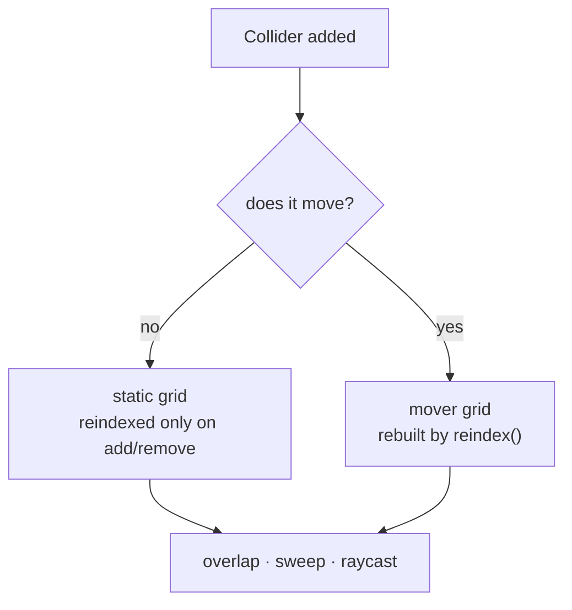

# Collision & physics

`flutter3d_physics` is plain Dart. No Flutter, no renderer, no `dart:io`, so all of it runs under `dart test` on the VM.

That is not tidiness. The failures this code has happen once in a thousand steps: a body that ends up inside geometry, a sweep that passes through a wall at speed, a platform that stops carrying its passenger. Finding those means running thousands of steps in a loop, which is possible exactly because none of it needs a device.

## Shapes

```dart
CollisionBox(Vector3(0.5, 0.9, 0.5));
CollisionSphere(0.35);
CollisionCapsule(radius: 0.35, halfHeight: 0.55);
```

`CollisionShape` is sealed and every pair is implemented exactly — box/box, box/sphere, box/capsule, sphere/sphere, sphere/capsule, capsule/capsule, plus a raycast per shape. No GJK, no approximation: three shapes are nine cases, and nine exact cases are cheaper to trust than one general algorithm nobody can debug.

## The world

```dart
final world = CollisionWorld();

final wall = world.addBox(
  Vector3(0, 2, -10), Vector3(20, 4, 1),
  userData: 'north wall',
);

final trigger = world.add(Collider(
  shape: CollisionBox(Vector3(1, 1, 1)),
  position: Vector3(4, 1, 0),
  kind: ColliderKind.trigger,
  layer: CollisionLayers.trigger,
  mask: CollisionLayers.player,
  userData: myMechanism,
)..listener = myMechanism);
```

| | |
|---|---|
| `ColliderKind` | `static` (level geometry), `kinematic` (doors, lifts, platforms) or `trigger` (blocks nothing, reports overlap) |
| `layer` / `mask` | Two colliders meet when **each is in the other's mask** |
| `userData` | Who this collider *is* — the one question it answers |
| `listener` | `onCollisionStart`, `onCollision`, `onCollisionEnd` |
| `delta` | How far a kinematic mover travelled this step, for a passenger to read |
| `surfaceVelocity` | What a conveyor adds to whatever stands on it |

### Two grids, not one



`SpatialGrid` is a uniform grid keyed on `(x, z)` — the cell is four metres. Statics are indexed once; movers are rebuilt by `reindex()`, which is why the step order calls it right after mechanisms have moved.

<div class="note">
<p><code>reindex()</code> before the body steps is <strong>ordering by argument, not by test</strong>. It is right — the broadphase should match geometry that already moved, but the narrow phase reads live positions and a cell is four metres, so a stale index loses a mover only if it left its cell inside one step. No door does. Nothing here claims a test covers it.</p>
</div>

## Queries

```dart
final hit = SweepHit();
if (world.sweep(shape, from, delta, hit, mask: CollisionLayers.world)) {
  // hit.collider, hit.normal, hit.time
}

final ray = RayHit();
if (world.raycast(origin, direction, 30.0, ray, mask: CollisionLayers.world)) {
  // ray.collider, ray.point, ray.normal, ray.distance
}

world.overlap(shape, position, nearby, mask: CollisionLayers.monster);

// Pushes a box out of whatever it ended up inside; `out` is the correction.
world.depenetrate(centre, halfExtents, out);
```

Sweeps are swept-AABB against the grid's ray walk, so a fast body does not tunnel. Everything here is allocation-free: hits are written into a caller-owned object, and the object is reused.

## The character controller

Kinematic. It sweeps and slides, and **nothing ever moves it**, which is what makes a first-person game feel solid.

```dart
final body = CharacterController(
  world: world,
  position: startPosition + Vector3(0, 0.9, 0),
  tuning: const MovementTuning(
    walkSpeed: 5.0,
    sprintSpeed: 8.0,
    groundAcceleration: 60.0,
    groundFriction: 10.0,
    airAcceleration: 12.0,
    gravity: -22.0,
    terminalVelocity: -55.0,
    jumpSpeed: 7.5,
    stepHeight: 0.4,
    coyoteTime: 0.12,
    jumpBufferTime: 0.12,
    groundProbe: 0.15,
  ),
);

body.requestJump();
body.step(dt, wishDirection: wish, sprint: input.held(GameAction.sprint));
```

| Member | What it is for |
|---|---|
| `isGrounded`, `ground`, `groundBody` | What is underfoot, and whether it is a mover |
| `requestJump()` | Buffers a jump; `jumpBufferTime` decides how long |
| `tryResize(shape, keepFeet: true)` | Crouch and stand, refused when there is no headroom |
| `teleport(to)` | A cut, not a move, no sweep, no carry |
| `solidFilter` | A `ContactFilter` that decides what counts as solid *for this body* |

### Coyote time and jump buffering

Both are latencies with a purpose, and both are properties of a body rather than of a control scheme:

- **Coyote time** keeps a jump legal for a moment after walking off an edge, because a player who pressed jump at the edge meant to jump.
- **Jump buffering** keeps a press alive for a moment before landing, because a player who pressed jump just before touching down meant to jump too.

### Carrying and riding

```dart
mechanisms.step(dt);              // the lift moves, writing collider.delta
collision.reindex();
body.step(dt, wishDirection: wish);  // reads the delta, and is carried
collision.update();
collision.clearKinematicDeltas();
```

<div class="warn">
<p><strong>A platform that moves sideways cannot carry you</strong> if the deltas are cleared before the body steps. Note <em>sideways</em>: a rising lift penetrates the capsule standing on it and the controller pushes it out, upwards, whether the delta was read or not, so the obvious test passes and the real bug survives.</p>
</div>

`solidFilter` is what a one-way platform is made of: the platform is solid when the body is above it and moving down, and not solid otherwise.

## Rigid bodies

`Dynamics` is stage one of two: mass, gravity, impulses, resting and sleeping, and **no rotation**, which is what makes a box stay axis-aligned and its contacts exact.

```dart
final dynamics = Dynamics(world: world)   // gravity defaults to the controller's
  ..positionIterations = 6;

final crate = dynamics.add(RigidBody(
  world: world,
  shape: CollisionBox(Vector3(0.6, 0.6, 0.6)),
  position: at,
  mass: 40.0,
  restitution: 0.0,
  friction: 0.6,
));

dynamics.step(dt);
```

### A character does not push anything on its own

That is not an oversight. The controller is kinematic and is never moved by anything, so the transfer is **explicit**, and it hands over a *speed* instead of a force:

```dart
body.step(dt, wishDirection: wish);
dynamics.push(body.collider, body.velocity, strength: 1.0);
```

<div class="why">
<p>A crate gets just enough velocity to move away at the speed it is being approached at, and no more. A force proportional to mass would let a player launch a light crate across the room by brushing it, which is exactly what the first version did.</p>
</div>

Gravity defaults to the character controller's, because a crate that falls slower than the player who dropped it reads as a bug in the crate. `positionIterations` is several cheap passes rather than one aggressive one: in a tall stack, the fraction the bottom crate moves is a new overlap for the one above, and a single hard correction throws the pile apart.

Bodies sleep when they stop, and wake when something touches them. A `Physical` component carries a body in a snapshot, so the next kind of moving thing cannot be left out of a save by omission.

## Layers are numbers here

A collider carries a `layer` and a `mask`, and two of them meet when each is in the other's mask. **Which bit means what is a game's business.** This package shipped as part of one for a while and its layer list named `monster`, `pickup` and `projectile` — exactly the knowledge a collision world must not have. `Layers.all` is the only constant left, because "every bit" means the same thing in every game.

The names live in [`flutter3d_game`](/core/simulation/#layers) as `CollisionLayers`, and a genre adds its own: the platformer's `PlatformerLayers.oneWay` is bit six.

## Next

- [Simulation layer](/core/simulation/): what drives a body
- [Platformer tutorial](/platformer/tutorial/): a controller pushed well past walking
