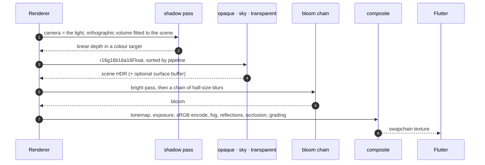
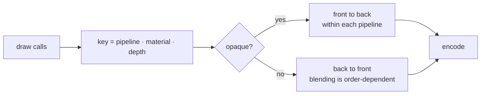

# The frame

One call takes a scene and gives back something Flutter can composite. Everything on this page is what happens in between.

```dart
final frame = renderer.render(
  width: (constraints.maxWidth * dpr).round().clamp(1, 8192),
  height: (constraints.maxHeight * dpr).round().clamp(1, 8192),
  scene: scene,
  views: <RenderView>[view],
  settings: RenderSettings(
    fog: fog,
    shadows: const ShadowSettings(cascades: 3, resolution: 1024),
  ),
);
return renderer.device.present(frame.frame);
```

<div class="note">
<p><code>device.present</code> rather than painting an image: a backend whose frame is composited elsewhere has no image to paint, and <code>present</code> is the one answer both can give.</p>
</div>

## The pass order



Each of those is a **separate command buffer**. Metal allows one open encoder per command buffer and `flutter_gpu` has no way to end a `RenderPass`, so a multi-pass frame needs a buffer per pass, submitted in order — buffers on one queue execute in submission order, which is also how the passes get sequenced.

## Render views

A `RenderView` is a camera plus where it draws and what it may see. A frame takes a list of them, which is how split screen, a minimap and a picture-in-picture rear view all work without the renderer knowing what any of those are.

```dart
final view = RenderView(camera: camera)
  ..viewportFraction = const ViewportRect(0.0, 0.0, 1.0, 1.0)
  ..layerMask = 0xFFFFFFFF      // which layers this view draws
  ..priority = 0                 // draw order between views
  ..opaqueSort = SortMode.frontToBack
  ..transparentSort = SortMode.backToFront
  ..clearColor = Vector4(0.05, 0.07, 0.12, 1.0);
```

| Field | What it decides |
|---|---|
| `camera` | The `CameraNode`, and therefore the projection and the view matrix |
| `viewportFraction` | Fractions of the target, so a split screen needs no pixel maths |
| `layerMask` | Which nodes this view is allowed to see |
| `priority` | The order views are encoded in |
| `opaqueSort` / `transparentSort` | Front-to-back for early-Z, back-to-front for blending |

<div class="warn">
<p><code>Viewport</code> and <code>Scissor</code> default to a <strong>zero-sized</strong> rect and the API does not complain about drawing into one. The symptom is a black viewport with no errors at all. Both are set explicitly every frame.</p>
</div>

## Sorting, and why the pipeline is the high-order key

Every shader is a separate `RenderPipeline`, and switching pipelines is the most expensive state change in a pass. So the render list sorts on the pipeline first and the material second, and depth only inside those.



`MaterialSortIds` hands each material a small integer so the key packs into one word. `key_sort.dart` needs no device and is unit tested on its own.

## HDR, exposure and tone mapping

The scene renders into `r16g16b16a16Float`. Tone mapping (Khronos PBR Neutral), exposure and the sRGB encode all happen in the composite pass.

That ordering is what lets bloom exist at all: a bright pass needs values above display white to threshold on, and an LDR target has none.

```dart
RenderSettings(
  exposure: 1.6,   // linear multiplier before the tone curve
  tonemap: true,   // off for a debug view: a normal-as-colour is not a light value
  specular: 1.0,
)
```

<div class="warn">
<p>A clear colour is authored display-referred, but the scene target holds linear light and the composite pass encodes on the way out. Convert the clear to linear or it goes through the encode twice and the background washes out.</p>
</div>

## Bloom

Built from a chain of half-size render targets instead of from mip levels. `flutter_gpu` had none when it was written, and now that it does, a bloom chain still wants separate targets it can blur *between*.

```dart
const BloomSettings(
  enabled: true,
  threshold: 1.0,    // display white — the only value with a physical meaning
  knee: 0.5,         // soft ramp below it, so the glow has no visible contour
  intensity: 0.06,
  levels: 5,         // each halving doubles the reach; this is the radius control
  filterRadius: 1.0,
)
```

## Shadows

The shadow pass is a render view whose camera is the light, with an orthographic volume fitted to the scene. Depth goes into a **colour** target, because depth textures cannot be sampled on this platform. Front faces are culled, and the lookup is PCF 3×3 with both a depth bias and a normal offset.

### Cascades

A single directional map fitted to the whole scene spends its resolution on ground the camera cannot see. On a level 120 m × 260 m that is about **fourteen centimetres of world per texel**, which draws a character's own shadow as a blurred slab beside them. It was reported as the character being drawn twice.

```dart
const ShadowSettings(
  cascades: 3,        // one to three, laid out side by side in one texture
  cascadeSplit: 0.7,  // 0 = even by distance, 1 = logarithmic
  resolution: 1024,
  bias: 0.0015,
  normalOffset: 0.02,
  casterFaces: ShadowCasterFaces.back,
)
```

<div class="warn">
<p>The atlas is <code>resolution × cascades</code> wide. Three cascades at the default 2048 is a six-thousand-pixel HDR texture and about a hundred megabytes. A game usually wants a <em>smaller tile and cascades</em> rather than a large tile without them: three tiles of 1024 cover a level far better than one of 4096.</p>
</div>

Cascades add no passes and no extra samplers. They share one texture and the fragment shader binds the same slot.

### Point lights

Point shadows use a cube atlas with its own bias, normal offset and a softness estimate that hardens contacts.

```dart
const ShadowSettings(
  pointBias: 0.08,           // in metres, unlike the directional bias
  pointNormalOffset: 0.02,
  pointSoftness: 4.0,
  pointLightRadius: 0.0,     // > 0 turns on the penumbra estimate
  pointMaxSoftness: 16.0,
)
```

<div class="why">
<p><code>showPointShadowDebug</code> paints the penumbra estimate into the surface buffer and composites that instead of the lit image — red is penumbra width, green is blocker distance, blue means the search found nothing. It exists because two explanations for a broken contact-hardening estimate were argued from the finished picture and both were wrong. The quantity that settles it never left the shader, so the debugging was five runs of guessing where it should have been one run of looking.</p>
</div>

## The surface buffer

The scene pass can write a second attachment holding world-space normal and depth, for a screen-space effect to read.

```dart
RenderSettings(
  surfaceBuffer: true,       // fill it
  showSurfaceBuffer: false,  // composite it instead of the scene, to check it
)
```

The shaders write it either way, a pipeline may declare more outputs than its target has attachments, so the flag is purely whether anybody is listening. Whether it is *needed* is answered by the compiled frame graph instead of by a setting, because a setting cannot see what nodes an application registered: `CompiledFrameGraph.isConsumed(FrameResourceIds.surfaceBuffer)`.

## Screen-space reflections

```dart
const ReflectionSettings(
  enabled: true,
  steps: 24,         // ray march length
  stride: 2.0,
  thickness: 0.5,    // depth tolerance for a hit
  intensity: 0.6,
  debugOnly: false,
)
```

SSR reads the surface buffer, so turning it on implies filling one.

## Ambient occlusion

```dart
const AmbientOcclusionSettings(
  enabled: true,
  radius: 0.5,     // world metres a surface looks for things blocking its sky
  samples: 12,     // the shader's loop is bounded at twelve whatever this says
  strength: 0.8,   // how dark a fully enclosed corner goes
  bias: 0.02,      // in metres, so one tuning works at every range
)
```

What it darkens is the **ambient term**, nothing else: applied to everything it stops being occlusion and becomes dirt in the corners, and it reads as a mistake under direct light. The occlusion is drawn into its own target and applied in the composite, after bloom has read the scene, so a glowing crack in a corner keeps glowing.

<div class="warn">
<p>Like SSR it reads the surface buffer, and filling that turns MSAA off for the whole scene pass: the average of two octahedral normals encodes no normal. Switching it on therefore changes the antialiasing of the entire frame, not only the corners.</p>
</div>

## Fog

```dart
FogSettings(
  color: Vector3(0.05, 0.07, 0.12),
  density: 0.004,
)
```

Applied in the composite pass, in linear space, before the encode. A level document can carry its own `fogColor` and `fogDensity`, which is how the games get theirs.

## Sky

```dart
SkySettings(
  enabled: true,        // off by default: sixty goldens are recorded against none
  zenith: Vector3(0.10, 0.22, 0.52),
  horizon: Vector3(0.42, 0.50, 0.62),
  nadir: Vector3(0.06, 0.06, 0.07),   // what fills the frame looking down at nothing
  sunIntensity: 20.0,   // 0 means no disc; the target is HDR, so far above 1 is fine
)
```

One full-screen triangle, encoded inside the scene pass between the opaque half and the transparent half: after the opaque half so that every covered pixel fails the depth test before the sky's fragment stage runs, and before the transparent half so glass has something to blend with. The model is a three-stop gradient plus a scattering lobe and an analytic sun disc; a `cubemap` replaces all three of those, with a `tint` on top. Colours are **linear and scene-referred**, multiplied by exposure and rolled through the tone curve like everything else, so the first sky anybody writes looks too bright. `SkySettings.sample(direction)` runs the same arithmetic on the CPU, for a fog colour that has to match the horizon or a light picked from the sky.

The painted alternative is `SkyDome` with a `SkyGradient`, an inside-out sphere with the colours baked into its vertices. It needs no shader and, unlike a frame-wide setting, can differ per `RenderView`; what it cannot do is a sun disc, and fog eats it unless it stays small and follows the camera.

## The look

Grading, vignette, grain and dispersion, applied inside the composite after the tone map. Everything defaults to doing nothing *exactly*: a vignette of zero multiplies by one and grain of zero adds zero, so a scene that asks for none of it composites to the same bytes it did before this existed.

```dart
const LookSettings(
  contrast: 1.05,      // pivoted about mid grey, so it does not also raise exposure
  saturation: 1.1,     // zero is luminance alone
  temperature: 0.1,    // warm above zero, cool below, in the range −1 to 1
  vignette: 0.3,
  grain: 0.04,         // static, not animated: a shader reading a frame counter
                       // is a shader whose golden differs every run
  chromaticAberration: 0.005,
)
```

The order inside the composite is the one a camera imposes: the lens disperses colour before the sensor sees it, grading is a decision about a displayable image and follows the tone map, and grain and vignette are the film and the barrel, so they come last.

## Observability

The parts worth reaching for when a frame looks wrong.

| Tool | What it gives |
|---|---|
| `DebugDrawOptions` | Bounds, vertex normals, light gizmos, world axes and camera frusta, all drawn in **one** call |
| `RenderSettings.highlighted` | Outlines a list of nodes, typically whatever picking last selected |
| `RenderSettings.wireframe` | Geometry without shading |
| `showShadowMap` / `showSurfaceBuffer` | Composites a buffer instead of the scene |
| Timeline spans | `dart:developer` spans around every frame phase |
| The frame panel | UI / raster / render / submit timings next to draw, pipeline-switch and cull counts |

<div class="why">
<p>A control wired to a settings panel but not to <code>RenderSettings</code> looks convincing. To find out, capture the same frame with the feature on and off and diff the two; a zero difference answers the question. The same check found five of six lighting goldens recording identical images, described under <a href="/reference/testing/">testing</a>.</p>
</div>

## Frame capture

Judging a render by eye does not scale, and grabbing the window needs a logged-in session with the display awake. The demo can write the render target straight to a PNG and quit.

```bash
flutter run -d macos \
  --dart-define=FLUTTER3D_CAPTURE=shot.png \
  --dart-define=FLUTTER3D_CAPTURE_FRAME=200 \
  --dart-define=FLUTTER3D_DEBUG_DRAW=bounds,normals,lights,axes,frusta \
  --dart-define=FLUTTER3D_SOURCE=teapot \
  --dart-define=FLUTTER3D_SPIN=false \
  --dart-define="FLUTTER3D_LIGHTS=key light,spot light" \
  --dart-define=FLUTTER3D_ANIM_TIME=0.75
```

`FLUTTER3D_SPIN=false` stops the turntable so two captures differ only by what is being tested, and `FLUTTER3D_ANIM_TIME` freezes a clip at a given second — without which two captures of an animated model are not comparable, because a format that loads faster starts playing sooner.

## Next

- [Scene graph](/core/scene/): what `render` is handed
- [Geometry & materials](/core/geometry/): what a pipeline draws
- [Pitfalls](/reference/pitfalls/): the platform conditions behind the pass structure
