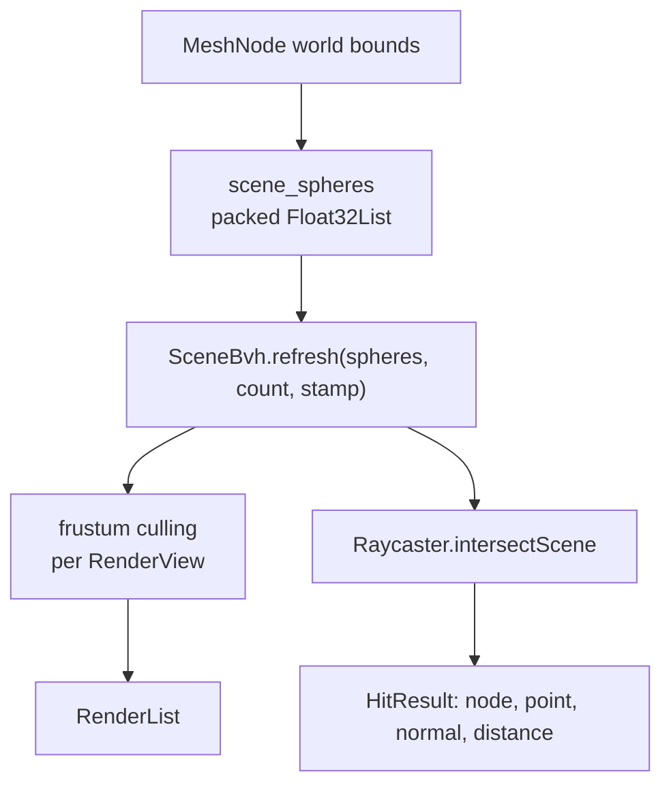

# Scene graph

A tree of nodes, a camera, some lights. Everything on this page needs no device at all, so bounds, culling, framing and picking are testable without one.

## Nodes

`SceneNode` holds a local transform and caches a world matrix. Children are attached, the world matrix invalidates down the subtree, and a **version stamp**, not a dirty flag — records that it changed.

```dart
final node = SceneNode(name: 'pivot')
  ..setPosition(0.0, 1.2, -3.0)
  ..setRotationYawPitchRoll(math.pi / 4, 0.0, 0.0)
  ..setUniformScale(0.5);

parent.add(node);                 // reparents, keeping the local transform
node.lookAt(Vector3(0, 1, 0));    // orients towards a world point
node.setLocalForward(Vector3(-0.4, -1.0, -0.3));
```

<div class="why">
<p>A stamp instead of a boolean because several readers want to know "has this changed <em>since I last looked</em>", and each of them has a different last time. The BVH asks it, the light buffer asks it, and a dirty flag can only answer the first one to clear it.</p>
</div>

`traverse`, `findByName`, `readWorldPosition`, `attach` (reparent without moving in world space) and `removeFromParent` are the rest of the surface. A cycle guard refuses to make a node its own ancestor.

## Scene

`Scene` is the root plus registries. Nodes announce themselves through `onAttachedToScene`, which is why adding a `MeshNode` makes it drawable and adding a `LightNode` makes it light without a separate call.

```dart
final scene = Scene()
  ..add(meshNode)
  ..add(lightNode)
  ..add(cameraNode);

final bounds = scene.computeBounds(visibleOnly: true);
final sun = scene.firstLightOfType(LightType.directional);
```

## Cameras and projections

```dart
final camera = CameraNode(
  projection: const PerspectiveProjection(fovYRadians: 1.05, near: 0.1, far: 220.0),
  name: 'player',
)
  ..setPositionFrom(eye)
  ..lookAt(target);
```

`Projection` is sealed: `PerspectiveProjection` and `OrthographicProjection`, both with `copyWith`. A `RenderView` reads `camera.viewProjection(aspect)`.

<div class="warn">
<p>Two conventions bite here, and both produce a picture rather than an error.</p>
<p><code>vector_math.makePerspectiveMatrix</code> produces OpenGL depth <code>[-1, 1]</code> while Impeller follows Metal/Vulkan's <code>[0, 1]</code>. The engine's matrix lives in <code>PerspectiveProjection.toMatrix</code>. And <strong>Y must not be flipped</strong>: Metal NDC has +Y up while the framebuffer origin is top-left, which already gives the right orientation. Flipping mirrors the image and therefore reverses on-screen winding, so culling discards exactly the visible faces and the symptom is "everything is culled away".</p>
</div>

### Orbit camera

```dart
final orbit = OrbitController(node: camera, distance: 6.0)
  ..rotate(dx * 0.005, dy * 0.005)
  ..zoom(1.1)
  ..pan(dx, dy, viewportHeight: size.height)
  ..frameBounds(scene.computeBounds())
  ..apply();
orbit.syncProjectionDepth(camera);   // near/far to fit what is framed
```

## Lights

Up to **eight** lights of any type, packed into `vec4[8]` uniform arrays with the count as a uniform, so switching a light on or off never rebuilds a pipeline.

```dart
scene.add(LightNode(
  type: LightType.spot,
  color: Vector3(1.0, 0.86, 0.7),
  intensity: 12.0,
  range: 14.0,                 // glTF's range window
  innerConeAngle: 0.25,
  outerConeAngle: 0.5,
  castsShadow: true,
)..setLocalForward(Vector3(0.0, -1.0, 0.2)));
```

| Type | Falloff | Extra |
|---|---|---|
| `LightType.directional` | none | direction only; the shadow caster |
| `LightType.point` | glTF inverse-square with a range window | cube shadows |
| `LightType.spot` | inverse-square plus a cone ramp | inner and outer cone angles |

`LightBuffer` gathers them each frame and falls back to `useDefaultLight()` for a scene with none, so an unlit-by-accident scene is visible rather than black.

<div class="warn">
<p><code>readDirection([out])</code> normalises <strong>in place</strong>. An earlier version ended in <code>result.normalized()</code>, which returns a new vector and leaves <code>out</code> holding the un-normalised, un-negated value, so the renderer read its own variable, the light direction was inverted, <code>N·L</code> went negative and clamped to zero, and the scene looked entirely ambient. Pinned now with <code>expect(returned, same(out))</code>.</p>
</div>

{{golden spot-shadow | A spot light casting from one column of the cube atlas, where a point light would write six.}}

## The BVH, culling and picking

One BVH over world bounds, shared by frustum culling and by picking, rebuilt only when something actually moves, which the version stamps make cheap to ask.



### Picking

```dart
// x and y are widget coordinates from the top left, exactly as Flutter
// reports a pointer. The Y flip and the aspect ratio live in here rather
// than at the call site, because those are the two things that get silently
// reversed.
final hit = Raycaster()
    .setFromScreen(camera, event.localPosition.dx, event.localPosition.dy,
        width: size.width, height: size.height)
    .intersectScene(scene);

if (hit != null) {
  settings = settings.copyWith(highlighted: <SceneNode>[hit.node!]);
}
```

Three intersection routines back it, all allocation-free: ray/AABB, ray/sphere and Möller–Trumbore ray/triangle. A node whose mesh kept its source `MeshData` is tested against triangles; one that did not falls back to its bounds.

### LOD groups

```dart
scene.add(LodGroup(levels: <LodLevel>[
  LodLevel(node: high, maxScreenFraction: 1.0),
  LodLevel(node: mid,  maxScreenFraction: 0.20),
  LodLevel(node: low,  maxScreenFraction: 0.05),
]));
```

Selection is by **screen coverage**, not distance: coverage already folds in the field of view and the object's size, so one threshold works for a pebble and a cathedral.

## Skeletons

A glTF skin decodes into a `Skeleton` of ordinary scene nodes, not a parallel hierarchy, so an animated parent carries its subtree the same way any node does.

```dart
skeleton.update(meshNode.worldMatrix);   // fills the joint matrix palette
final bounds = skeleton.computeBounds(reach: 0.1);
```

- **64 joint matrices** in a uniform array, four weights a vertex.
- A skinned primitive gets the **skinned vertex layout**, chosen from the data instead of from the caller — the layout and the shader are one decision, so a mesh has both or neither.
- Bounds come from the **posed** skeleton rather than the bind pose, because a character that reaches out of its bind-pose box gets culled at exactly the moment it becomes interesting.

## View-model nodes

`ViewModelNode` draws with its own field of view and its own depth range, on top of the scene. That is what a weapon held in the hands needs: a 90° scene camera makes a gun in the corner of the screen look like it is being fired from the elbow.

{{golden view-model-overlay | A held box drawn over the scene in its own pass, placed deliberately inside the model to show it is not clipped by the world.}}

## Next

- [Geometry & materials](/core/geometry/): what a `MeshNode` holds
- [Assets & animation](/core/assets/), where a skeleton comes from
- [The frame](/core/rendering/): what the renderer does with all of it
