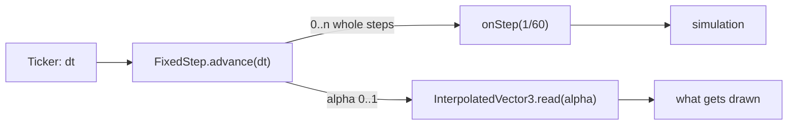
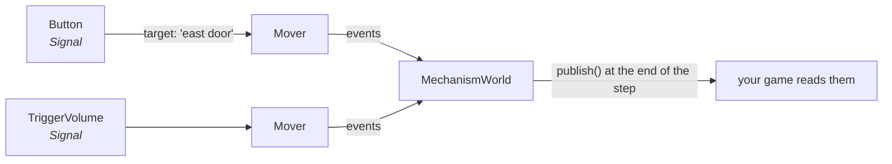

# Simulation layer

`flutter3d_sim` is the half that runs without a device. It knows what a body, a brain, a mechanism and a step are, and nothing about what any of them is doing, because that belongs to a genre.

It is plain Dart, with no Flutter anywhere, and a scan says so. The devices stayed behind in `flutter3d_game`: the touch stick, the keyboard and mouse, the gamepad route and the widget that hosts them, which re-exports the whole of this package so a game that imported that one keeps working. The reason is a server: one that verifies a submitted run has to replay it through the same simulation the player ran, and that server is a Dart process in a container with no Flutter SDK.

## The fixed step

```dart
final loop = GameLoop(
  input: input,
  onStep: (double dt) => simulation.step(dt),
  drainLook: devices.drainLook,
);

// Once a frame, from a Ticker.
loop.paused = !devices.isCaptured;
final steps = loop.advance(dt.clamp(0.0, 0.25));

// Draw at the interpolated position, not the last stepped one.
drawnAt.read(loop.alpha, out);
```

`FixedStep` accumulates real time and hands out whole steps, capped by `maxStepsPerFrame` so a stall does not turn into a spiral of death. `loop.alpha` is the fraction between the last two steps.



<div class="why">
<p>Interpolation is not polish. The step is 60 Hz and the display may not be; a body drawn at the last step's position judders on a 120 Hz monitor even though the simulation is perfectly smooth. <code>InterpolatedVector3</code> and <code>InterpolatedAngle</code> hold the previous and current value and read between them, and <code>jumpTo</code> exists for a teleport, because easing from where somebody died to where they respawned is a second of the level flying past for no reason.</p>
</div>

After loading a level, call `loop.clock.reset()`. Loading blocked the ticker for a couple of seconds and all of that time is sitting in the accumulator; none of it happened in the game, so it is dropped rather than simulated.

## Input

`InputState` has forgotten which device it came from. Actions, not keys.

```dart
input.held(GameAction.moveForward);   // is it down now
input.pressed(GameAction.jump);       // did it go down this step — latched
input.released(GameAction.fire);
input.moveAxis;                       // combined WASD / stick, normalised
input.lookDelta;                      // mouse or right stick
```

Latched edges are the point: a press that happens between two steps must still be seen by the step that follows, or a jump gets swallowed at a low frame rate. `endStep()` clears the latches.

```dart
final devices = DesktopInput(
  state: input,
  bindings: DesktopInput.defaultBindings()
    ..bind(InputSource.key(LogicalKeyboardKey.controlLeft.keyId),
           PlatformerActions.dropThrough),
);
```

Your game defines its own actions the same way the built-in ones are defined:

```dart
abstract final class MyActions {
  static const GameAction grapple = GameAction('grapple');
}
```

`setStickAxis` is the seam a gamepad or touch backend would write to. None exists yet.

<div class="note">
<p>Relative mouse deltas need pointer lock, which Flutter exposes on no desktop platform and does not surface in a browser either. <code>packages/pointer_lock</code> supplies it on macOS by breaking the association between the physical mouse and the on-screen cursor, so <code>mouseMoved</code> events keep arriving with their deltas while the cursor stays put — and in a browser through <code>requestPointerLock</code>, which is why a web build of a first-person game is now played with the mouse instead of by dragging the world around.</p>
</div>

## The level format

A level is JSON: brushes, materials, lights, entities, fog, and where to go next.

```json
{
  "version": 1,
  "name": "Ascent",
  "fogColor": [0.05, 0.07, 0.12],
  "fogDensity": 0.004,
  "materials": {
    "ice": { "roughness": 1.0, "albedo": "assets/textures/ice_albedo.png",
             "normal": "assets/textures/ice_normal.png",
             "orm": "assets/textures/ice_orm.png", "texelsPerMetre": 0.4 }
  },
  "brushes": [
    {"at": [0, -0.5, 124.5], "size": [120, 1, 7], "material": "ice", "surface": "ice"}
  ],
  "entities": [
    {"type": "player_spawn", "at": [0, 0, -20], "yaw": 0},
    {"type": "collectible", "at": [4, 1, 8], "what": "coin", "howMany": 1}
  ]
}
```

| Concept | What it is |
|---|---|
| `Brush` | An axis-aligned box: centre, size, material, optional `surface` name, optional layer, `solid` |
| `LevelMaterial` | Base colour, roughness, metallic, emissive, `texelsPerMetre`, and albedo/normal/ORM paths |
| `LevelLight` | Type, position, direction, colour, intensity, range, `castsShadow` |
| `EntityDef` | A `type`, a position, a yaw, a name, and free-form `properties` |

`Level.ofType('torch')`, `Level.named('east door')` and `Level.materialFor(brush)` are the read side. `brush_geometry.dart` turns brushes into mesh data and `level_collision.dart` turns them into colliders.

The format's own entity words are `EntityTypes`: `player_spawn`, `key`, `door`, `lift`, `platform`, `button`, `trigger`, `exit`, and `reflection_probe` — a point the room around it is [reflected from](/core/rendering/#reflection-probes), with optional `radius`, `intensity`, `faceSize`, `levels`, `near` and `far`. Pure data to the simulation: `ReflectionProbeKind` validates one and spawns nothing, and the bridge's `LevelLoader` builds the probe the way it builds a light node.

### Holes in the walls

A brush is a box, and a box minus a box is at most six boxes, so a hole is arithmetic rather than mesh surgery. `subtractBox(brush, hole)` returns what is left of one brush; `Breaches` keeps the level's current brush list, swaps the colliders a hole cut for the colliders of the pieces, and bumps a `version` so whoever draws the level rebuilds its batches.

```dart
final breaches = Breaches(level, collision,
    breakable: (Brush b) => b.solid && b.ramp == null && b.material == 'wall');

// A rocket against a wall: 1.6 m wide, 2 m high, 2 m deep, from the surface in.
breaches.blast(hit.position, hit.normal);
```

The snapshot carries the holes, six numbers each, and restoring replays them onto the level as authored, which is also how a demo with a rocket in it arrives at the same walls. A ramp is never cut, since a wedge minus a box is not a set of wedges. The navigation grid keeps its walls: a monster does not learn a route through a breach, which is a limit and not a bug.

### Entity kinds: the level's vocabulary is your game's

There is **no ready-made registry**, and that is deliberate. There was one, and it listed fourteen kinds, a spawn point, three movers, a button, a trigger, a note, an exit, a monster, a pickup, a key and three lamps. A second game loading a level got every one of them.

```dart
final kinds = EntityRegistry(<EntityKind>[
  const PlayerSpawnKind(),
  const DoorKind(),
  MonsterKind(myMonsters),   // only if this game has monsters
  MyOwnKind(),               // and whatever it invents
]);
```

Writing one is two methods — validate, and spawn:

```dart
final class TurretKind extends EntityKind {
  const TurretKind() : super('turret');

  @override
  void validate(EntityDef entity, LevelScope scope, List<LevelIssue> out) {
    requireText(entity, scope, out, 'facing');
    requireTarget(entity, scope, out, 'shootsAt');
  }

  @override
  void spawn(EntityDef entity, SpawnContext context) {
    final collider = place(entity, context, size: Vector3(1, 2, 1));
    context.actors.spawn(position: entity.position, brain: TurretBrain());
  }
}
```

<div class="why">
<p><strong>The same registry validates a document and spawns it</strong>, so the two cannot disagree about what a level may contain. That is the failure this seam was built to remove: a validator that accepts an entity the spawner ignores produces a level that loads clean and is missing a door.</p>
</div>

### The validator

`LevelValidator` checks what is true of any level whatever the game is: names unique, references resolving, brushes not degenerate, something to stand on, something to see by. Rules about a level *as a whole* — "exactly one player spawn", "warn about a missing exit" — are a shooter's rules, not the format's, so they are `LevelRule`s a game passes in.

```dart
final issues = LevelValidator(registry: kinds, rules: myRules()).validate(level);
for (final issue in issues) debugPrint('level: $issue');
```

## Mechanisms

Everything in a level that does something: doors, lifts, platforms, buttons, trigger volumes, exits, pickups, lamps.



```dart
final mechanisms = MechanismWorld(collisionWorld);

// during the step
mechanisms.step(dt);
collision.reindex();

// at the end of it
mechanisms.publish();
for (final Mechanism m in mechanisms.events.started) { /* a sound */ }
for (final String message in mechanisms.events.messages) { /* a line of HUD */ }
```

`Activation` carries who is activating and which keys they hold; the outcome is `Activated`, `Refused(message)` or `NothingToDo`. **Each mechanism reports itself** through `Mechanism.collect` instead of the world type-testing its members, which is what lets a game's own mechanism report events the package has never heard of.

<div class="why">
<p>Lists, not streams. A <code>Stream</code> delivers <em>after</em> the step that produced the event, which is the one property this package exists to protect. A list cleared at the top of each step is synchronous, typed, and allocates nothing.</p>
<p><code>publish()</code> is called at the <strong>end</strong> of the simulation step, not from <code>step()</code>. A button pressed with the use key runs after mechanisms have stepped, so a door it starts is not yet moving when <code>step</code> returns — publishing there would report every such door a step late.</p>
</div>

### The order a step runs in

This is the part that is easy to get wrong and hard to notice.

```dart
mechanisms.step(dt);            // doors and lifts move
collision.reindex();            // ... and the broadphase learns where they are
body.step(dt, ...);             // then the player sweeps against them
collision.update();
collision.clearKinematicDeltas();
```

- **A platform that moves sideways cannot carry you** if the kinematic deltas are cleared before the body steps. Tested, and the reason the test has to use a *sideways* platform is on the [physics page](/core/physics/#carrying-and-riding).
- **A `Mover` refuses to move into any body**, and a passenger standing on it overlaps where it is about to be on every step. No lift in the repository could move while anybody rode it, until `Rider` was there to tell being carried from being in the way.

## Actors and brains

`Actor` is an entity and a handle, and **every part of it is optional**. Each part left out is a component the entity does not carry.

| Left out | What that is |
|---|---|
| no body | a turret, a trigger, a director that decides and stands nowhere |
| no health | a lift, a lamp post, a rocket may ask and get "nothing happened" |
| no brain | a barrel, or anything the game moves itself |
| no facing | anything with no front, which then does not turn |

`isAlive` is true for an actor with no health, because nothing to kill is not the same as dead.

```dart
final class Patrol extends Brain {
  @override
  void think(Mind it) {
    if (it.canSee()) _target = it.system.focus;
  }

  @override
  void act(Mind it) {
    it.steerTowards(_next);
    it.turnTowards(_next.x, _next.z);
  }

  @override
  void onHurt(Mind it, double amount) { /* flinch, or do not */ }

  @override
  Map<String, Object?> save() => <String, Object?>{'leg': _leg};
}
```

`ActorSystem` steps them, **throttles their thinking**, turns them, routes them round corners, tests lines of sight, applies damage, counts deaths and stops corpses blocking corridors. None of it knows what any of them is doing.

<div class="warn">
<p>Thinking used to be staggered across steps by <code>Object.hashCode</code>, which is an address, so two runs of the same game with the same seed diverged. It is an ordinal now, and the determinism test that found it did so on its first run.</p>
</div>

### Who a collider is

`Collider.userData` answers **one** question: *who is this?* Callers ask it `is Damageable`, `is Rider`, `is Collector`.

It used to answer two, a monster on one collider and the player's *inventory* on another, which is what the body carries rather than who it is. That is why dealing damage took two branches, one testing `userData` and one testing the collider's layer, and why neither could have been written by a game with a third thing worth shooting.

## Navigation

Optional. Null keeps the plain behaviour: see the player, walk straight, get stuck on the corner.

```dart
final issues = <LevelIssue>[];
actors.navigation = Navigation.bake(level, cellSize: 0.25, issues: issues);

// each step, when the goal moved
actors.navigation?.update(playerPosition);
```

Three decisions, each with an alternative that looks better and is not:

- **A grid, not a navmesh.** A navmesh's advantage is arbitrary walkable surfaces. This format has axis-aligned boxes and no slopes, so the navmesh pipeline's output would be the rectangles you could have rasterised directly.
- **One flow field, not thirty A\* searches.** Nothing targets anything but the player, so thirty searches would compute thirty prefixes of one tree. The sweep runs only when the player crosses into another cell.
- **Baked from `Level.brushes`, not from the `CollisionWorld`.** The world holds the doors, and whichever position one happened to be in at load would be frozen into the grid as architecture.

<div class="warn">
<p><strong>Cell size is the setting that matters, and half a metre is often too coarse.</strong> A grid is conservative: a cell touching a wall has a clearance of one however far the wall actually is. At <code>cellSize: 0.5</code> a one-metre corridor is two cells, both touching, so a monster 0.7 wide, which physically fits — is refused the whole passage, and the grid silently falls back to walking straight at the player in exactly the places a route is worth having. The dungeon bakes at 0.25 for that reason.</p>
<p><strong>One <code>Navigation</code> means one goal.</strong> <code>update</code> re-targets every field it holds. Two callers with different destinations must not share one, or the second one's fields quietly flow to the first one's goal and the symptom is an agent that looks stuck.</p>
</div>

### Jump links

The grid is a walk: a rise of at most a step, a drop of at most a fall. A platformer is made of everything outside that, and a field over the grid alone reports every pit and every ledge as no way there. A jump link is one extra edge, from a cell at an edge across the cells the walk refuses to a cell on the far side, with the rise and the gap written on it.

```dart
actors.navigation = Navigation.bake(level, jumps: JumpReach.of(const MovementTuning()));
```

Links are baked once with the most capable reach a level's bodies have, and a field for a particular body filters them by its own: `JumpReach` is three numbers, jump speed, gravity and running speed, and `gapFor(rise)` is the later root of the flight. A heavy guard with a short hop is never sent across a gap the light one clears. The body's own width is added to every gap, because a link is measured centre to centre between two edge cells and a body's centre stops a radius short of each. `Mind.steerTowardsFocus` follows the route and jumps where the next step is a link, through the same buffered request the player's jump goes through, so a brain that asks every step asks once.

<div class="note">
<p>A jump costs two cells more than its distance, so a walk of the same length is preferred and a link is taken only where the walk is longer or does not exist. A body in the air cannot turn, and the field does not ask that of it for nothing. Not modelled: headroom along the arc, landings on moving platforms, and a run-up longer than the take-off cell. The platformer's <code>Hunter</code> is the brain built on this: it comes after the player across the gaps, and a test runs a real body over a real three-metre pit.</p>
</div>

### The automap

The grid is already the map: every cell an agent can stand in is floor, baked from the brushes for the monsters before anybody thought of drawing it. `Automap` adds the memory, which cells the player has been near, and it reveals by *walking*: a flood from the player's cell across cells an agent could step between, so a wall stops the reveal the way it stops the player, and the room behind a closed door stays dark until it opens.

```dart
final automap = Automap(navigation.grid, revealRadius: 6.0);

automap.reveal(player.position);      // each step
automap.revealAll(player.position);   // a map pickup: everything reachable from here
```

Walls are the cells the walk could not enter, not the cells nobody can stand in; the grid calls a roof walkable, because a wall's column has one standing place and it is on top. What was seen goes into the snapshot as runs of bits. `AutomapView` in `flutter3d_screens` paints it, centred on the player and turned the way they face, and the dungeon shows it on M with the fight running underneath.

## The ECS, and how far it has got

`EcsWorld` is tested, and **two systems have moved onto it: actors and projectiles.** Mechanisms and the player still hold their own state and write their own saves.

It was accepted for one reason: replication. A snapshot with delta compression needs state enumerable in one place, and a hand-written `save()` enumerates it a line per subsystem, so it will silently miss the next one added.

```dart
final entities = EcsWorld();
final actors = ActorSystem(world: collision, entities: entities);
final projectiles = ProjectileSystem(world: collision, entities: entities);

final data = entities.save();   // refuses a component type nobody registered
```

It is **not** accepted for cache locality and delivers none — components live in maps keyed by entity index. The condition that would change that is written in the file: a query walking thousands of entities per step, showing up in a profile.

`registerInPlace` exists because a `CharacterController` owns a collider in a live world and a `Brain` is code as much as data. Neither can be rebuilt from a file, and neither needs to be, because a snapshot restores a world that already exists, so those components take their numbers back rather than being reconstructed.

## Snapshots

A save file, a network packet and the input to a determinism test are the same thing, so there is one mechanism rather than three.

```dart
final Snapshot snapshot = simulation.save();
// ...
simulation.restore(snapshot);
```

<div class="note">
<p><strong>It is not a level loader.</strong> A snapshot restores objects that already exist: the same collision world, the same monsters in the same order, the same mechanisms under the same names. That boundary is what saves it from inventing an identity scheme for every collider. Load the level, then apply the snapshot. It is versioned like the level format and refuses a document from a newer build, for the same reason: subtly wrong is worse than refused.</p>
</div>

`GameRandom` exists because `math.Random` has no readable state, which makes it the one thing in a simulation that cannot be written down. Pass one instance everywhere and two loads of the same save agree for ever; leave it out and they agree until the first flinch roll.

The other half of a determinism test is the input, and `InputTape` is that: what the player did, one entry per fixed step, recorded as transitions rather than the held set. A replay, a reproducible bug report and a test that plays a whole level all run off one tape at a few bytes a second.

### Demos

A demo is a save plus a tape. `Demo` is a level name, the `Snapshot` a run started from and the `InputTape` of every step after, and because a step reaches for no clock and no loose dice, the three reproduce the run exactly, monsters and all.

```dart
final recorder = InputTapeRecorder(seed: seed);
loop.recorders.add(recorder);              // written as each step is taken

// When the run ends, either way.
demos.write(Demo(level: levelName, start: startSnapshot, tape: recorder.tape));
```

`GameLoop.recorders` is a list, so a demo recorder and a rewind buffer can both listen. The dungeon records every run and writes the last one as `demo.json` through `DemoFile` when it ends, so the file that reproduces a bug exists before anybody thinks to ask for it.

<div class="why">
<p>A test plays six hundred steps of the shipped crypt through the document as a string and back, and holds the two snapshots byte-equal. It found the tape dropping weapon-slot requests on its first run: positions, dice and a dead monster all agreed, and the replay arrived holding the pistol where the player had switched to the shotgun.</p>
</div>

### Rewind

`RewindBuffer` is a demo with its middle kept: one keyframe a second and a tape entry a step for the last `history` seconds, and nothing older. A moment in the recent past is a keyframe and the entries to play forward from it.

```dart
final rewind = RewindBuffer(stepsPerSecond: 60, history: 3.0, seed: seed);
loop.recorders.add(rewind.recorder);

// After each step.
if (rewind.keyframeDue) rewind.keyframe(sim.save());

// A kill camera: the last three seconds, through the ordinary step.
final RewindPoint? point = rewind.rewindBy(3.0);
if (point != null) sim.restore(point.snapshot);   // then play the tape forward from point.step
```

`history` is a game's number, not the engine's: a kill camera wants three seconds, a rewind mechanic wants whatever the design says. The dungeon's kill camera restores the state three seconds before a death and plays the tape through the ordinary step, sounds and all, with the camera standing back from the body, then puts the death back. Three things had to be held for that to work: the restored state says the game is being played and the run session must not announce a new level on seeing it; the devices write into the same `InputState` the tape does and are `muted` while it plays, the tape lifting the mute for its own writes; and the buffer's own recorder is taken out, so the replay is not recorded into the run's history.

## Layers

```dart
abstract final class CollisionLayers {
  static const int world = 1 << 0;    // also Collider's default layer
  static const int player = 1 << 1;   // also CharacterController's default
  static const int monster = 1 << 2;
  static const int pickup = 1 << 4;
  static const int trigger = 1 << 5;
  static const int all = Layers.all;
}
```

The names live here instead of in `flutter3d_physics`, because a collision world that knows what a monster is cannot be used by a game that has none. Five bits are a **default, not a law**: a game with vehicles or water adds bits six upwards, and nothing in either package reads the names. The platformer does exactly that with `PlatformerLayers.oneWay` at bit six.

## What it does not do

- **Navigation gets you there, not around you.** No flanking, no cover, no squads, no doors opened by monsters, and nothing reserves the space it is walking into.
- **A game flow with nowhere to go.** `GameState` is `playing`, `dead` or `complete`, and an `Exit` reports where to go next, but nothing restarts a level and nothing loads the next one.
- **No camera, and that is not an omission.** What a projection matrix should do about the player's eye belongs to the renderer. Third-person, over-the-shoulder and fixed cameras are all a caller reading `eye` and `aim` differently.
- **No animation, no persistence, no timers.** Nothing here schedules anything; a game that wants a delayed event counts down itself.

## Next

- [Collision & physics](/core/physics/): what a body sweeps against
- [Shooter](/shooter/), [Platformer](/platformer/) and [Racing](/racing/): three genres built on all of this
