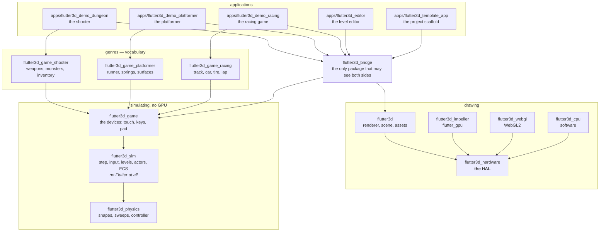

A 3D engine on Flutter GPU

# Three games, one engine, no edits in between

flutter3d is a renderer, a game layer, and three finished games of different genres. The second and third were built without changing a line in the first one's engine packages.

**Playable right now, in this browser:** [the shooter](/shooter/demo/) · [the platformer](/platformer/demo/) · [the racing game](/racing/demo/).

  
One frame, as this engine encodes itone command buffer per pass

  

    
<b>shadow</b>4 cascades linear depth

    
<b>opaque</b>sorted by pipeline

    
<b>transparent</b>back to front no depth write

    
<b>bloom</b>half-size chain blur between

    
<b>composite</b>tonemap exposure, sRGB

    
<b>overlay</b>debug lines view model

  

  
The first four render into <code>r16g16b16a16Float</code>. Metal allows one open encoder per command buffer and flutter_gpu cannot end a render pass, so each pass gets its own command buffer, submitted in order.

## Status

| | |
|---|---|
| Channel | Flutter 3.47.0 stable, Dart 3.12.2 |
| Platforms | macOS and the browser are supported and exercised; Android is played on a real handset (Impeller Vulkan, touch controls); iOS runs clean in the simulator on Metal; Windows and Linux are unverified |
| Published | Yes — 23 of the 24 packages, on [pub.dev](https://pub.dev/publishers/pleion.dev/packages) under the pleion.dev publisher |
| Stability | Pre-1.0. The graphics HAL carries a written compatibility promise; nothing else does |

## Where to start

<ul class="cards">
  <li><a href="/quickstart/">
    15 minutes
    <h3>Quickstart</h3>
    
Resolve the workspace, build the shader bundle, and put a lit mesh on screen.

  </a></li>
  <li><a href="/first-project/">
    An afternoon
    <h3>Your first project</h3>
    
Scaffold one from the editor's template, run it, edit its level, change how it feels.

  </a></li>
  <li><a href="/core/">
    Engine
    <h3>Core</h3>
    
The renderer, the scene graph, geometry, assets, the fixed step and collision.

  </a></li>
  <li><a href="/shooter/demo/">
    Genre · playable
    <h3>Shooter</h3>
    
Weapons, hitscan and projectiles, monsters that path around corners, an inventory, locked doors.

  </a></li>
  <li><a href="/platformer/demo/">
    Genre · playable
    <h3>Platformer</h3>
    
A double jump with coyote time, wall slides, ice and conveyors, springs, checkpoints.

  </a></li>
  <li><a href="/racing/demo/">
    Genre · playable
    <h3>Racing</h3>
    
A track as a measured curve, a tire that falls away past its peak, laps that cannot be cheated, AI drivers and ghosts.

  </a></li>
</ul>

All three run in a browser on the WebGL2 backend and are embedded on their demo pages. The racing game was the holdout — well under a frame a second for months — and [its demo page keeps the hunt](/racing/demo/): the cost was a cube shadow atlas sized from the sun's setting, four hundred megabytes of texture on a platform with less, which no reduction in frame size could touch.

## The package split

Twenty-four packages. Each boundary is a rule that a test enforces.

Five more packages exist that this diagram deliberately leaves out, because none of them changes what an app may know: `flutter3d_backend` picks the device (Impeller or WebGL2) at compile time, so the conditional import an app needs is written once and not per project; `flutter3d_session` holds `SceneSurface` and `RunSession`, the frame surface and level lifecycle that every app used to reimplement; `flutter3d_screens` is the settings, rebinding and save screens no game owns; `pad_input` and `pointer_lock` are gamepad and mouse-capture, read once per frame like everything else `flutter3d_game` polls. `flutter3d_app` re-exports all five, so an application names the assembly layer once. [Assembling an application](/core/session/) walks all five with the real code that uses them. One more, `flutter3d_conformance`, is test-only: it is what a backend has to pass before it can appear in the table below. The rules this diagram states are not a package at all — they are `tool/structure.dart`, twenty-two checks that read source text and run before a build.

Three rules hold the picture up, and `tool/structure.dart` checks each one before a build.

- **`flutter3d_game` does not depend on `flutter3d`.** Simulation, input and collision say nothing about how a frame is drawn. That is what lets the failures which never show up in a screenshot be reached from a plain unit test: a collision that passes through a wall once in a thousand steps, a jump that is a different height on a faster monitor, a press swallowed at a low frame rate.
- **A genre is a package.** `flutter3d_game_shooter` holds what only a shooter wants, so a platformer inherits none of its vocabulary. Two rules check it: no package outside a genre may import one, and none may *say* a genre word — `oneWay`, `ammo` and `lapTime` import nothing and are the same leak.
- **The engine names no graphics API.** `flutter3d` is written against a hardware abstraction layer, `flutter3d_hardware`, and three backends implement it. Checked in both directions: the engine may not name `flutter_gpu`, and the layer may not name Flutter.

The bridge exists because neither of the first two rules leaves anywhere for the mapping to live. Level geometry has to become mesh nodes and an actor has to get a visual, while the game layer must not learn what a mesh is and the renderer must not learn what a monster is. One package is allowed to know both.

## One HAL, three backends

The renderer talks to a hardware abstraction layer and never to a graphics API. Three packages implement that layer.

| Backend | Runs on | Status |
|---|---|---|
| `flutter3d_impeller` | `flutter_gpu`: Metal on Apple platforms, Vulkan elsewhere | Complete. All three games ship on it |
| `flutter3d_webgl` | WebGL2, in the browser | Runs the shooter and the platformer, slower and at a fixed resolution. The racing game renders and is too slow to play |
| `flutter3d_cpu` | Nothing. It rasterises in Dart | Complete for the golden set. A dev dependency of every game, and now `flutter3d_backend`'s last resort too |

`flutter3d_conformance` is the suite a fourth backend would have to pass before it belonged in this table — clears that cover the whole attachment, upload/readback row order, HDR renderability, shader stage linking. It runs against all three backends, including Impeller through `packages/flutter3d_impeller/tool/conformance.sh`, which the harness itself has to be, since Flutter GPU requires Impeller and a headless `flutter test` cannot give it one.

`flutter3d_backend` — the package picking which of these three an application gets — tries Impeller first on every native build and only reaches for the CPU backend at runtime, if Impeller throws. [Assembling an application](/core/session/) is where that fallback is documented.

An application names one of them in its pubspec and hands the device to `Renderer.create`. Moving between them is that line and one constructor call.

Each backend exists for a different reason. Impeller is the production one. WebGL2 answers whether the HAL is a seam or a description of Impeller, because a fake backend can only show that an interface is callable, never that it is implementable. The CPU rasteriser shares no driver, shading language or command buffer with either of the others, so agreement with it means more than agreement between two GPU backends would.

[How the HAL is put together](/core/architecture/#the-hal) · [Writing a fourth backend](/core/backends/)

## What is in the box

| | |
|---|---|
| Rendering | Six lighting models as pre-built shaders. HDR pipeline with tone mapping and exposure, bloom from a half-size chain, cascaded directional shadows with PCF, point-light shadows with a static half baked once, instanced batches, precomputed visibility for brush levels, screen-space reflections, fog, 4× MSAA, wireframe |
| Geometry | Surfaces of revolution as the base generator, `MeshData` and `MeshBuilder`, custom vertex layouts, tangent generation with Lengyel's method |
| Assets | glTF 2.0 / GLB, Wavefront OBJ, and `.f3d`, the engine's own container. Decoding on a background isolate, a reference-counted cache |
| Animation | All three glTF interpolations, skinning with 64 joint matrices, an `AnimationPlayer` with crossfades, transport and once/loop/ping-pong |
| Scene | Version-stamped nodes, a BVH shared by culling and picking, LOD groups by screen coverage, orbit and follow cameras, CPU raycasting |
| Simulation | A fixed step with interpolation, device-agnostic input with latched edges, a level format with a validator, holes blown in its walls, mechanisms, actors and brains, a navigation grid with flow fields and an automap drawn from it, an ECS, snapshots, demos that replay a run exactly, a rewind buffer for a kill camera |
| Input | Gamepad through `pad_input` on macOS, iOS, Web and Android, read as a per-frame snapshot; desktop mouse capture for FPS-style cameras through `pointer_lock`, so far on macOS only |
| Physics | Overlap, sweeps and rays over a uniform-grid broadphase, a character controller that walks, jumps, climbs a step and rides a lift, and rigid bodies without rotation |
| Driving | A track as a spline with width, camber and surface bands, a sphere-and-frame vehicle, a tire curve with a friction circle, lap counting through checkpoints, AI drivers and ghost tapes |
| Extras | A pooled particle system that draws in one call, positional audio with attenuation, panning, voice limiting, and occlusion through the level's walls that muffles a sound as well as quietening it |

## What it does not do

- **No runtime shader compilation.** Shaders are compiled ahead of time into a bundle, so a material graph assembled while the game runs is not possible. Every lighting model is a separate pre-built shader and every shader is a separate pipeline.
- **No compressed textures, no compute passes, no rendering into a mip level.** These are what `flutter_gpu` still lacks.
- **No navmesh, no flanking, no squads.** Navigation gets an agent there, not around you.
- **No touch backend, and no gamepad or mouse capture on Windows or Linux.** `pad_input` covers macOS, iOS, Web and Android; `pointer_lock` covers macOS only. `InputState` is device-agnostic, so the remaining platforms are new implementations of an existing seam, not a design change.
- **No morph targets, no Draco, no KTX2.** A decoder reports these in `warnings` rather than failing the file.
