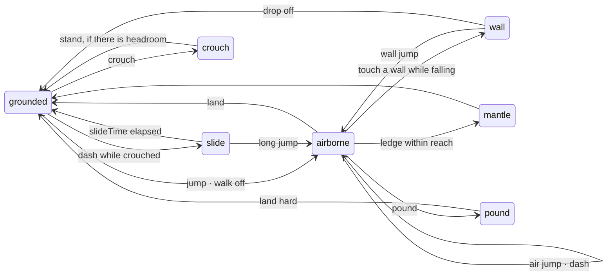

# What a platformer adds

The second genre, and the instrument that tested the first. The brief was "a game that is not a shooter, without a single edit in the engine", and the value of it is not the game, it is what the attempt found.

Three hardcoded object types had already been dug out of the engine by *imagining* this one. Sketching it for real found five more, all in input, and they were fixed rather than worked around. `GameAction` stopped being an enum because there was no way to write `PlatformerActions.dropThrough` without editing the engine.

| Taken from core, unchanged | Brought by this genre |
|---|---|
| The fixed step, `CharacterController` | Its own jump policy — the controller's is a shooter's |
| The level format and its validator | `Purse`, `Collectible`, `Checkpoint`, `Hazard` |
| `EntityRegistry`, mechanisms, movers | `Surfaces` — the table from a brush's word to movement numbers |
| Riders, exits, health, the ECS, snapshots | `FollowCamera`, and its own step order |

Nothing here imports the renderer, so all of it runs in a test with no device.

## The runner

A `CharacterController` walks, jumps, climbs a step and rides a lift. That is a shooter's body. A platformer's needs eleven verbs, and `Runner` owns all of them:



Every one of those is a number in `RunnerTuning`, and each number has a reason:

| Setting | Default | Why that number |
|---|---|---|
| `jumpSpeed` | 9.5 | About 1.88 m of height |
| `airJumpSpeed` | 8.2 | Weaker, so a double jump reads as a recovery instead of a second staircase |
| `jumpCut` | 0.45 | What is left of upward speed when the button comes up early: **variable jump height**. Why that is the control that matters is in the [tutorial](/platformer/tutorial/) |
| `coyoteTime` | 0.12 | A jump stays legal after walking off an edge |
| `jumpBufferTime` | 0.12 | A press stays alive just before landing |
| `wallJumpUp` / `wallJumpPush` | 9.0 / 7.5 | The push is what stops a chimney becoming a ladder |
| `wallCoyoteTime` | 0.12 | Coyote time again: the player pressed jump when they were on the wall |
| `mantleLow` / `mantleHigh` | 0.35 / 1.5 | Below the low figure the controller's step-up already handles it; above the high one, deliberately under a jump's 1.88 m, a mantle is for the ledge you *just* missed |
| `dashSpeed` / `dashCooldown` | 18.0 / 0.55 | On the press edge only. A dash you can hold is a second walk speed |
| `slideSpeed` / `slideTime` | 11.0 / 0.55 | Faster than a sprint or nobody slides; short-lived or it replaces running |
| `longJumpUp` / `longJumpPush` | 6.0 / 12.0 | A low, long arc: crosses gaps a normal jump cannot and reaches ledges it can — worth learning rather than strictly better |
| `poundSpeed` | 26.0 | Well past terminal velocity, because the point is that it arrives *now* |
| `stompBounce` / `stompBounceHeld` | 7.5 / 11.0 | The held figure is above a standing jump, so a chain of stomps climbs |
| `dropThroughTime` | 0.25 | About 40 cm of fall — enough to clear any platform a level authors |
| `crouchHeight` | 0.45 | Half of standing, which makes a one-metre gap a crawlspace rather than a decoration |

<div class="why">
<p>The runner owns its jump and the controller does not mind. <code>CharacterController.tuning.jumpSpeed</code> is still there and still works; what it cannot do is a second jump in the air, a variable height, a wall jump or a cut. Rather than growing four flags on a type a shooter also uses, the runner sets <code>body.velocity.y</code> itself, which is exactly what a kinematic controller is for.</p>
</div>

## Surfaces

The engine gives a brush a `surface`, a word, and no opinion about what it means. `Surfaces` is the other half: a genre's table from that word to movement numbers.

```dart
final runner = Runner(
  body: CharacterController(world: collision, position: start),
  surfaces: Surfaces.common(),   // ice and mud
);
```

```dart
factory Surfaces.common() => const Surfaces(<String, MovementTuning>{
      'ice': MovementTuning(
        groundFriction: 3.0,        // almost no grip
        groundAcceleration: 12.0,   // and you gather speed slowly
      ),
      'mud': MovementTuning(
        walkSpeed: 2.6, sprintSpeed: 3.4,
        groundAcceleration: 30.0, groundFriction: 70.0,
        jumpSpeed: 6.0,
      ),
    });
```

<div class="why">
<p>One table instead of a field per effect, because "how does this floor feel" is every number in <code>MovementTuning</code> at once: ice is low friction <em>and</em> low acceleration, mud is low speed <em>and</em> high friction. A friction multiplier would have been the first of five.</p>
</div>

The word lives in the level document, on the brush, beside the material that paints it:

```json
{"at": [0, -0.5, 124.5], "size": [120, 1, 7], "material": "ice", "surface": "ice"}
```

## What a level may contain

```dart
EntityRegistry platformerRegistry({Dynamics? dynamics}) =>
    EntityRegistry(<EntityKind>[
      const PlayerSpawnKind(), const DoorKind(), const LiftKind(),
      const PlatformKind(), const ButtonKind(), const TriggerKind(),
      const ExitKind(),
      const CollectibleKind(), const HazardKind(), const CheckpointKind(),
      const KeyKind(), CrateKind(dynamics: dynamics), const SpringKind(),
      const OneWayKind(), const ConveyorKind(), const CrumblingKind(),
      const BreakableKind(), const ClimbableKind(), const EnemyKind(),
      LightFixtureKind(PlatformerEntities.lamp,
          defaultBehaviour: const FlameFlicker(),
          defaultSize: Vector3(0.4, 1.6, 0.4)),
    ]);
```

| Entity | What it does |
|---|---|
| `collectible` | Coins and anything else counted. Goes into the `Purse` |
| `checkpoint` | Ordered; a death puts the runner back at the highest one reached |
| `hazard` | Damage per second or instant, and can `follow` a mover |
| `spring` | Launches whatever lands on it, through the `Launchable` interface |
| `oneway` | Solid from above only, on layer bit six |
| `conveyor` | Writes `surfaceVelocity`, which the controller adds to whatever stands on it |
| `crumbling` | Gives way `delay` seconds after taking weight, comes back after `gone` |
| `breakable` | Shatters when something hits it hard enough, a ground pound |
| `climbable` | A rope or vine, with `swing` and `period` |
| `crate` | A `RigidBody` the runner can push |
| `enemy` | A `Patrol` or a `Leaper` brain, stompable |

## Enemies are brains, not a monster system

```dart
final class Patrol extends Brain {
  // Walks a route, pauses at each end, and refuses to walk off a ledge —
  // which it finds with a sweep rather than by being told where the floor is.
}

final class Leaper extends Patrol {
  // A patrol that jumps the gap when the landing is solid.
}
```

Both are ordinary `Brain`s driven by the engine's `ActorSystem`. No genre-specific system, no monster type — the platformer's enemies and the shooter's use the same machinery and share none of the vocabulary. For a while nothing stepped the system at all, and so there were no enemies; the [tutorial's simulation step](/platformer/tutorial/#the-simulation-and-the-camera-that-owns-forward) keeps that story.

## The follow camera

The game layer has no camera type and that is deliberate. A third-person one is a caller reading `position` differently, so it lives here.

```dart
final camera = FollowCamera(world: collision, tuning: const FollowTuning(
  distance: 7.0, height: 2.6, aimHeight: 1.2,
  lag: 9.0,                 // units a second of the remaining gap
  pitch: -0.22, minPitch: -1.2, maxPitch: 0.9,
  sensitivity: 0.0035,
  nearClearance: 0.35,      // how far in front of a wall it stops
  minDistance: 1.2,
  impulseDecay: 9.0,
));

camera.look(input.lookDelta);
camera.follow(drawnPosition, dt);
sim.cameraYaw = camera.yaw;    // the camera owns "forward"
```

It also carries the feel:

```dart
camera.kick(Vector3(0, -0.18 * hardness, 0));  // a landing dips the view
camera.shake(0.22, seconds: 0.3);              // a ground pound
camera.widen(0.1);                             // a dash, and speed
camera.cut();                                  // a death: a cut, not a chase
```

<div class="why">
<p><code>lag</code> is exponential instead of a fixed speed, so it is frame-rate independent and never overshoots, a camera that oscillates around the player is a camera that makes people ill. And <code>cut()</code> after a death exists because easing from where they died to where they came back is a second of the level flying past for no reason.</p>
</div>

## Its own step order

The sibling of the shooter's `GameSimulation`, and the reason that one had to leave the engine: its step reads a weapon, an arsenal, a use key and an exit, and four of those five mean nothing here.

```dart
void step(double dt) {
  // mechanisms move · the broadphase catches up · dynamics run ·
  // the body sweeps · overlaps dispatch · floor surface is read ·
  // actors think and stomps resolve · checkpoints · collectibles ·
  // the kill plane · exits
}
```

What the two share is the *order*, and it is documented in both because it is the part that is easy to get wrong and impossible to see.

```dart
final sim = PlatformerSimulation(
  runner: runner,
  collision: collision,
  input: input,
  startAt: start,           // the feet, as a level authors it
  mechanisms: mechanisms,
  dynamics: dynamics,
  actors: actors,
  levelNext: level.next,
  killPlane: -20.0,
);
```

<div class="note">
<p><code>killPlane</code> is something a platformer needs and a shooter does not: a shooter's floor is continuous, and a platformer's floor is the interesting part. Without it a player who misses a jump falls at terminal velocity for ever and the game looks hung rather than lost.</p>
</div>

## Events, per step

```dart
runner.jumpedThisStep;      runner.airJumpsLeft;
runner.dashedThisStep;      runner.wallJumpedThisStep;
runner.landedThisStep;      runner.landingSpeed;
runner.poundedThisStep;     runner.mantledThisStep;
runner.slidThisStep;        runner.grabbedThisStep;

sim.takenThisStep;              // List<Collectible>
sim.reachedCheckpointThisStep;
sim.stompedThisStep;
sim.deaths;
```

`landedThisStep` reports **how hard**. The application used to work that out from whether the runner was grounded last frame, which cannot know the speed, so a soft landing and a twenty-metre drop produced the same puff of dust.

## Ready to build one?

The [platformer tutorial](/platformer/tutorial/) assembles all of this in fourteen steps.
