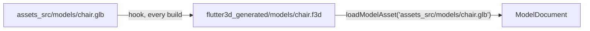

# The asset pipeline

Source models and textures live in a project's own `assets_src/`; a build hook converts them into `flutter3d_generated/` on every `flutter build`/`flutter run`, and the engine loads the converted files by their source name. No step to remember, and no committed binary that drifts from the source it was built from.



## Wiring a project

```bash
dart run flutter3d_build:init
```

Writes four things, each idempotent:

| | |
|---|---|
| `hook/build.dart` | Calls `buildAssets`, the function the Flutter tool runs during a real build |
| `pubspec.yaml`'s `dev_dependencies:` | `flutter3d_build`, pinned the way the rest of the project pins its dependencies |
| `pubspec.yaml`'s `flutter: assets:` | `flutter3d_generated/`, and one line per subdirectory a source actually converts into; the warning below says why more than one line |
| `.gitignore` | `/flutter3d_generated/`: generated, never committed |

`--check` reports what a run would change without changing it; `--force` overwrites a `hook/build.dart` a person has edited, which is otherwise left alone and reported instead. A second run of `init` on an already-wired project is a no-op.

<div class="warn">
<p><strong>Flutter's own asset bundler does not read a declared directory recursively.</strong> <code>flutter_tools</code> lists it with a plain <code>listSync()</code>, without <code>recursive: true</code>. A source at <code>assets_src/models/chair.glb</code> converts to <code>flutter3d_generated/models/chair.f3d</code>, and a <code>pubspec.yaml</code> naming only <code>flutter3d_generated/</code> bundles the hook's own bookkeeping file and drops every model in <code>models/</code> without a warning. Two of this repository's own games shipped like that until their pubspecs gained the second line. <code>init</code> declares a line per subdirectory that actually holds a converted file, computed from the real sources on disk each time it runs, instead of one line assumed to cover everything under it.</p>
</div>

<div class="warn">
<p><strong>A dependency added after the last build needs <code>flutter clean</code> before the hook runs.</strong> The build system's own incremental cache can remember "this project has no hooks" from before <code>flutter3d_build</code> was added, and neither a fresh <code>pubspec.yaml</code> nor a deleted <code>flutter3d_generated/</code> on their own make it look again; only a full clean does. The same cause <code>apps/flutter3d_demo_racing</code>'s own <code>pubspec.yaml</code> already names for SoLoud's "no available native assets".</p>
</div>

## What gets converted, and where

Without a manifest, every recognised file under `assets_src/` maps to `flutter3d_generated/` with the same relative path, extension swapped to `.f3d`. An empty `assets_src/`, or none at all, plans nothing: that is a project that has not added a model yet, not an error.

With `flutter3d_assets.yaml` at the project root, a list of rules overrides the default per file:

```yaml
rules:
  - glob: "props/**.obj"
    textures: etc2
  - glob: "props/placeholder.obj"
    exclude: true
```

| Key | Meaning |
|---|---|
| `glob` | Matched against the path relative to `assets_src/`. `package:glob`'s own rule applies, and since `glob` 2.2.0 `**/*.obj` matches a root-level `a.obj` as well as `props/a.obj` |
| `textures` | `auto` \| `bc` \| `etc2` \| `universal` \| `none`, overriding the build's own family for files this rule matches |
| `mips` | `true`/`false`: skip the mip chain for files this rule matches |
| `objNormals` | `smooth` \| `flat` \| `none`, for an OBJ with no normals of its own |
| `exclude` | Leaves the file alone: no conversion, no entry in `flutter3d_generated/` |

<div class="warn">
<p><strong>Only <code>exclude</code> reaches the build hook today.</strong> The manifest parses all five keys and <code>AssetLayout.plan</code> carries the matching rule with every file it plans, but <code>buildAssets</code> converts each one with the converter's defaults: a rule's <code>textures</code>, <code>mips</code> and <code>objNormals</code> are read, checked, and not yet applied.</p>
</div>

The **last** matching rule wins, not the first, so a broad rule and a narrower exception below it read the way a person writes them. A bad glob or an unknown key names the line it is on, in `flutter3d_assets.yaml:N: ...` form, because the manifest's own author reads that error, not a player of the finished game.

## Texture families

The hook is told which platform it is building for, and takes the family that platform guarantees. That is a fact about the platform, not a guess about a device:

| Building for | Family | Why |
|---|---|---|
| macOS, Windows, Linux | BC | Every desktop GPU samples it |
| Android, iOS | ETC2 | Required by OpenGL ES 3.0, and by Metal on every iOS device the engine runs on |
| The web, or anything that names no target | none: textures ship as they arrived | A browser is whatever machine it runs on |

Every compressed texture carries a mip chain, down to the last level that is whole 4×4 blocks. A project overrides the family in its hook user defines, under its **own** package name, because `hook/build.dart` is the project's hook and a hook reads only its own package's defines:

```yaml
hooks:
  user_defines:
    my_game:                # this project's `name:`
      textures: universal   # or bc, etc2, none
```

**`universal` is the answer for a build that ships to more than one family**, the web above all. It is not a GPU format but a 4×4 block intermediate, cooked once; the upload turns it into BC, ASTC, ETC2 or RGBA8 against what the device says it samples, so one file serves a laptop and a phone from the same build, at sixteen bytes a block.

By hand, the converter takes the family by name, and `--no-mips` keeps the base level alone:

```bash
dart run flutter3d_build:convert assets_src/chair.glb --textures universal
```

`--textures auto` on the command line compresses nothing: the machine converting a texture is not the one that loads it, and only a build knows its target.

## Loading by source path

```dart
final document = await loadModelAsset('assets_src/models/chair.glb');
```

Reads the converted `flutter3d_generated/models/chair.f3d`. Missing it means two different things on purpose:

- **In debug**, decodes `assets_src/models/chair.glb` directly instead, and prints one warning the first time, not one per frame. A project with no build yet still draws something.
- **Outside debug**, throws a `StateError` naming `flutter3d_build:init`. A release build that shipped without its own hook ever running is a real problem, and paying the decode cost on every load without a word would hide it.

The debug fallback reads the source straight off disk, which only exists during `flutter run`/`flutter test` from a checkout: never in a shipped build, and never on the web, which has no `dart:io`. There, a missing generated file is the release error in every build mode.

A path somebody else wrote, such as a level document naming a coin's model, goes through `loadModelByPath` instead: `assets_src/…` is handed to `loadModelAsset`, anything else is read from the bundle exactly as it always was. `FixtureVisuals` and `ActorVisuals` in `flutter3d_game`, the level-driven loaders every game shares, both load through it, so a game that has not moved onto the pipeline keeps working unchanged. The strategy game is one: its models still live in `assets/models/` and are bundled as they stand, while the dungeon, the platformer and the racer load theirs from `assets_src/`.

## When the hook fails

| Symptom | Cause |
|---|---|
| `flutter analyze` says an asset directory does not exist | Expected on a fresh checkout: hooks run during a real build, never during `analyze`, and the declared directory has nothing in it yet. Build once |
| `flutter analyze` says `hook/build.dart`'s own imports are not a dependency | `hook/` sits outside `test/`, where the analyzer does not look for `dev_dependencies:`. Excluded from analysis in `analysis_options.yaml`, the way generated platform folders already are |
| A model that used to load throws in release | The generated `.f3d` is missing from the shipped bundle. Check that every subdirectory under `flutter3d_generated/` has its own `pubspec.yaml` line, and that the build ran with `flutter3d_build` as a real dependency, not added after the last build with no `flutter clean` since |
| A build with a brand-new `flutter3d_build` dependency still skips the hook | `flutter clean`, then build again; the warning above says why |

## What this does not cover

Level geometry (BSP brushes) names its own surface textures directly in the level document, read by `LevelLoader`. That is a completely different path from a model's own materials, and one this pipeline has no way to convert a bare texture file for: `AssetLayout.plan` recognises model files, and an image is only ever converted as part of the model document that carries it, which a level material is not. Those textures stay hand-placed and hand-committed.

## Next

- [Assets & animation](/core/assets/): the runtime side (decoders, `.f3d`, loading, skinning, morph targets)
- [Package index](/reference/packages/#flutter3d_build): where `flutter3d_build` sits among the rest
- [Testing](/reference/testing/): what `dart run tool/structure.dart` holds every package to
