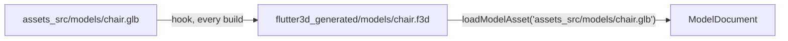

# The asset pipeline

Source models and textures live in a project's own `assets_src/`; a build hook converts them into `flutter3d_generated/` on every `flutter build`/`flutter run`, and the engine loads the converted files by their source name. No step to remember, and no committed binary that drifts from the source it was built from.



## Wiring a project

```bash
dart run flutter3d_build:init
```

Writes four things, each idempotent:

| | |
|---|---|
| `hook/build.dart` | Calls `buildAssets`, the function the Flutter tool runs during a real build |
| `pubspec.yaml`'s `dev_dependencies:` | `flutter3d_build`, pinned the way the rest of the project pins its dependencies |
| `pubspec.yaml`'s `flutter: assets:` | `flutter3d_generated/`, and one line per subdirectory a source actually converts into; the warning below says why more than one line |
| `.gitignore` | `/flutter3d_generated/`: generated, never committed |

`--check` reports what a run would change without changing it; `--force` overwrites a `hook/build.dart` a person has edited, which is otherwise left alone and reported instead. A second run of `init` on an already-wired project is a no-op.

<div class="warn">
<p><strong>Flutter's own asset bundler does not read a declared directory recursively.</strong> <code>flutter_tools</code> lists it with a plain <code>listSync()</code>, without <code>recursive: true</code>. A source at <code>assets_src/models/chair.glb</code> converts to <code>flutter3d_generated/models/chair.f3d</code>, and a <code>pubspec.yaml</code> naming only <code>flutter3d_generated/</code> bundles the hook's own bookkeeping file and drops every model in <code>models/</code> without a warning. Two of this repository's own games shipped like that until their pubspecs gained the second line. <code>init</code> declares a line per subdirectory that actually holds a converted file, computed from the real sources on disk each time it runs, instead of one line assumed to cover everything under it.</p>
</div>

<div class="warn">
<p><strong>A dependency added after the last build needs <code>flutter clean</code> before the hook runs.</strong> The build system's own incremental cache can remember "this project has no hooks" from before <code>flutter3d_build</code> was added, and neither a fresh <code>pubspec.yaml</code> nor a deleted <code>flutter3d_generated/</code> on their own make it look again; only a full clean does. The same cause <code>apps/flutter3d_demo_racing</code>'s own <code>pubspec.yaml</code> already names for SoLoud's "no available native assets".</p>
</div>

## What gets converted, and where

Without a manifest, every recognised file under `assets_src/` maps to `flutter3d_generated/` with the same relative path, extension swapped to `.f3d`. An empty `assets_src/`, or none at all, plans nothing: that is a project that has not added a model yet, not an error.

With `flutter3d_assets.yaml` at the project root, a list of rules overrides the default per file:

```yaml
rules:
  - glob: "props/**.obj"
    textures: etc2
  - glob: "props/placeholder.obj"
    exclude: true
```

| Key | Meaning |
|---|---|
| `glob` | Matched against the path relative to `assets_src/`. `package:glob`'s own rule applies, and since `glob` 2.2.0 `**/*.obj` matches a root-level `a.obj` as well as `props/a.obj` |
| `textures` | `auto` \| `bc` \| `etc2` \| `universal` \| `none`, overriding the build's own family for files this rule matches |
| `mips` | `true`/`false`: skip the mip chain for files this rule matches |
| `objNormals` | `smooth` \| `flat` \| `none`, for an OBJ with no normals of its own |
| `lods` | A list of triangle ratios, each strictly between 0 and 1: `lods: [0.5, 0.25]`. One simplified level per ratio, [below](#lods) |
| `impostor` | `true` ends each node's levels in a baked card |
| `chunks` | `true`, or a triangle count: split static meshes above it into clusters the renderer culls one by one |
| `exclude` | Leaves the file alone: no conversion, no entry in `flutter3d_generated/` |

<div class="warn">
<p><strong>A rule's <code>textures</code>, <code>mips</code> and <code>objNormals</code> do not reach the build hook yet.</strong> The manifest parses all eight keys and <code>AssetLayout.plan</code> carries the matching rule with every file it plans. <code>buildAssets</code> applies <code>exclude</code>, <code>lods</code>, <code>impostor</code> and <code>chunks</code>, and converts everything else with the converter's defaults and the build's own texture family: those three keys are read, checked, and ignored.</p>
</div>

The **last** matching rule wins, not the first, so a broad rule and a narrower exception below it read the way a person writes them. A bad glob or an unknown key names the line it is on, in `flutter3d_assets.yaml:N: ...` form, because the manifest's own author reads that error, not a player of the finished game.

## Levels of detail, impostors and chunks {#lods}

Three things the converter can add to a model, each off until a rule or a flag asks for it. They are the same options on the command line and in the manifest:

```bash
dart run flutter3d_build:convert assets_src/tree.glb --lods=0.5,0.25,0.1 --impostor
dart run flutter3d_build:convert assets_src/scan.glb --chunks
```

```yaml
rules:
  - glob: "trees/**.glb"
    lods: [0.5, 0.25, 0.1]
    impostor: true
  - glob: "scans/**.glb"
    chunks: 200000
```

**`lods`** cuts one level per ratio from every node's full mesh, with `flutter3d_mesh`'s attribute-aware simplifier, and measures how far each level is from the full mesh (`surfaceDeviation`). The file carries that distance, and the node switches to a level once it is less than a pixel wrong on screen. A viewer that cannot count pixels uses the older rule: the level takes over when the node covers less than half the square root of the ratio of the screen, so a quarter of the triangles takes over below a quarter of the screen. A surface with morph targets stays whole in every level, since a simplified mesh has no deltas to blend, and a node whose surfaces all morph gets no levels at all. Each level adds its triangles to the file. `generateLods` does the same from Dart and returns a `LodLevelReport` per ratio.

**`impostor`** ends the chain in a card that turns to face the eye. Every node that draws something is drawn by the software rasteriser from 8×8 directions laid out on an octahedral map, into an albedo atlas and a normal-depth atlas, and the bytes come out the same on every machine. At run time the node's `LodGroup` ends in an `ImpostorNode`: one draw, receiving shadows and casting none. At the default cell of 64 texels that is two 512×512 atlases per node. A texture the bake cannot decode is baked as its material's base colour, and the report names it. On five trees at the switch distance, 11% of the silhouette differs from the mesh and the mean colour error is under 13 steps a channel. `bakeImpostors` is the Dart entry.

**`chunks`** is for scans and CAD exports, one mesh of hundreds of thousands of triangles where most of it is off screen or behind the rest. Every static mesh above the threshold (65536 triangles for `true` and a bare `--chunks`, `kDefaultChunkThreshold`) is split into runs of up to 4096 triangles, each with a box and a cone of normals, and the scene pass tests each run against the view, its facing and the occlusion test. No vertex moves, and a skinned or morphing mesh stays whole. The table goes in a `.f3d` section of its own, written only when a mesh has one, so a reader from before 0.8.0 loads the same file and draws the whole mesh. `splitLargeMeshes` is the Dart entry.

## One file per device class {#classes}

A phone and a desktop can load different cuts of the same source. `classes:` sits beside `rules:` and names the classes to build for:

```yaml
classes: [phone, web, desktop]
rules:
  - glob: "**/*.glb"
    lods: [0.5, 0.25]
```

Each model is then written once per class, `chair.phone.f3d`, `chair.web.f3d` and `chair.desktop.f3d`, in place of `chair.f3d`, and each carries its own level-of-detail chain, impostor and largest texture side. The presets are `DeviceClassBudget`'s:

| Class | Levels of detail | Impostor | Textures fit to | Light tolerance |
|---|---|---|---|---|
| `phone` | 0.5, 0.25, 0.1 | yes, cell 32 | `TextureBudget.mobile` | 0.04 |
| `web` | 0.5, 0.25 | yes, cell 64 | `TextureBudget.web` | 0.02 |
| `desktop` | the rule's own | the rule's own | `TextureBudget.desktop` | 0.01 |

A mapping in place of the list changes a preset's numbers, and a class left empty keeps its preset:

```yaml
classes:
  phone:
    maxTextureSide: 512
    impostorCell: 32
  desktop:
```

The keys a class takes are `lods`, `impostor`, `impostorCell`, `maxTextureSide` and `lightDifference`, the last of which is for [a level's lights](#lights) and not for models. An image larger than `maxTextureSide` on either axis is box-filtered down before the texture encoder sees it. `convert --classes phone,desktop` does the same from the command line, with the presets, and applies `--lods` and `--impostor` where a class names no chain of its own.

**Which files a build carries depends on its target.** A native build writes the phone and desktop files, because a native application may be given either: a slow laptop reads the phone's, a tablet that samples BC reads the desktop's. A web build writes the web files alone, because a browser reads nothing else. The Flutter tool asks for a web build with no code configuration, and the hook takes that to mean the web. A project that builds some other way names its classes itself, in the same place as the texture family:

```yaml
hooks:
  user_defines:
    my_game:
      deviceClasses: [web]
```

The hook deletes class files an earlier build left behind, since the generated directory is bundled whole and a phone's models would otherwise ship in a web build. It still writes the single `.f3d` whenever a class it carries has no file of its own, so the loader always has something to fall back to. A manifest without `classes:` builds exactly what it built before, to the same cache entries.

### How the running application picks a class

The class is chosen once, on the loading screen, and remembered. `flutter3d_core` holds the choice:

```dart
final picker = DeviceClassPicker(
  traits: DeviceTraits.of(device, web: kIsWeb),
  memory: mySettingsBackedMemory,        // a DeviceClassMemory
);
assetDeviceClass = await picker.pick(
  measure: () => measureFrameMicros(drawProbeFrame),
);
```

`DeviceClassSelector` makes the decision. A browser is `web`. Otherwise a GPU that samples a BC format is a `desktop` and one that does not is a `phone`, because BC support comes with the silicon and a power saver cannot switch it off. The measurement can only demote: a desktop part whose probe frame takes longer than `desktopMicros` (8000 µs, half a 60 Hz frame) is given the phone's files, and a phone that measures fast on a cool loading screen stays a phone. `measureFrameMicros` throws away two warm-up frames and takes the median of eight. What `pick` stores says whether it was measured or chosen, so `picker.override(DeviceClass.phone)` sticks and `override(null)` measures again on the next launch. An override the device cannot read, a phone class on the web, throws an `ArgumentError`.

`assetDeviceClass` is what every loader reads when its caller names no class. `loadModelAsset('assets_src/chair.glb', deviceClass: ...)` tries `chair.phone.f3d` first and falls back to `chair.f3d`, which costs one missed read, and `LevelLoader.load` reads `crypt.phone.json` before `crypt.json` in the same way. Null, the default, reads exactly what 0.7 read.

## Upgrading from 0.7: one full conversion

`kAssetPipelineVersion` is 2. A rule can now ask for levels of detail, an impostor or chunks, and an output cached by 0.7 may be missing them, so the first build after the upgrade converts every source once. After that a source is skipped when its bytes, the pipeline version, the texture family and what its rule asks for are all unchanged, as before.

## Texture families {#texture-families}

The hook is told which platform it is building for, and takes the family that platform guarantees. That is a fact about the platform, not a guess about a device:

| Building for | Family | Why |
|---|---|---|
| macOS, Windows, Linux | BC | Every desktop GPU samples it |
| Android, iOS | ETC2 | Required by OpenGL ES 3.0, and by Metal on every iOS device the engine runs on |
| The web, or anything that names no target | none: textures ship as they arrived | A browser is whatever machine it runs on |

Every compressed texture carries a mip chain, down to the last level that is whole 4×4 blocks. A project overrides the family in its hook user defines, under its **own** package name, because `hook/build.dart` is the project's hook and a hook reads only its own package's defines:

```yaml
hooks:
  user_defines:
    my_game:                # this project's `name:`
      textures: universal   # or bc, etc2, none
```

**`universal` is the answer for a build that ships to more than one family**, the web above all. It is not a GPU format but a 4×4 block intermediate, cooked once; the upload turns it into BC, ASTC, ETC2 or RGBA8 against what the device says it samples, so one file serves a laptop and a phone from the same build, at twenty bytes a block.

By hand, the converter takes the family by name, and `--no-mips` keeps the base level alone:

```bash
dart run flutter3d_build:convert assets_src/chair.glb --textures universal
```

`--textures auto` on the command line compresses nothing: the machine converting a texture is not the one that loads it, and only a build knows its target.

## Loading by source path

```dart
final document = await loadModelAsset('assets_src/models/chair.glb');
```

Reads the converted `flutter3d_generated/models/chair.f3d`. Missing it means two different things on purpose:

- **In debug**, decodes `assets_src/models/chair.glb` directly instead, and prints one warning the first time, not one per frame. A project with no build yet still draws something.
- **Outside debug**, throws a `StateError` naming `flutter3d_build:init`. A release build that shipped without its own hook ever running is a real problem, and paying the decode cost on every load without a word would hide it.

The debug fallback reads the source straight off disk, which only exists during `flutter run`/`flutter test` from a checkout: never in a shipped build, and never on the web, which has no `dart:io`. There, a missing generated file is the release error in every build mode.

A path somebody else wrote, such as a level document naming a coin's model, goes through `loadModelByPath` instead: `assets_src/…` is handed to `loadModelAsset`, anything else is read from the bundle exactly as it always was. `FixtureVisuals` and `ActorVisuals` in `flutter3d_game`, the level-driven loaders every game shares, both load through it, so a game that has not moved onto the pipeline keeps working unchanged. The strategy game is one: its models still live in `assets/models/` and are bundled as they stand, while the dungeon, the platformer and the racer load theirs from `assets_src/`.

## Gaussian splat captures {#splats}

`convert` also takes a splat capture, a `.ply` of fitted Gaussians or its compressed `.spz` form, and writes a `.f3dsplat`: an octree whose inner nodes are merged, coarser versions of their children, stored coarse levels first so a viewer reads only the pages its cut needs.

```bash
dart run flutter3d_build:convert captures/garden.spz -o web/garden.f3dsplat
```

The converter reads the tree back and counts its leaves against the source before it reports success. Walking a directory, a `.ply` counts as a capture only when its header names `f_dc_0`, the fitted colour, so a folder that also holds a mesh saved as PLY still converts; a `.ply` named on its own is always tried, and refused with the reason. `convertSplat` is the Dart entry.

The build hook does not convert captures. `AssetLayout.plan` recognises model files only, so a capture is converted by hand and served however the application serves large files. The runtime side is on [Assets & animation](/core/assets/#splats).

## A level's lights {#lights}

```bash
dart run flutter3d_build:lights --optimize assets/levels/crypt.json --dry-run
```

Finds a smaller set of lights that lights the level the way it is lit now. Every light is drawn alone, in software, from a set of views; a light the others already cover is removed, a close pair is merged into one, and the rest are retuned, and a change is kept only while the picture stays within the optimizer's bounds. The plan that comes out is drawn again for real and held to the same bounds, and one that misses them is reported and not written.

| Option | |
|---|---|
| `--poses <file.json>` | Where players stood, as the list a game's `Recorder` writes while it plays a run back. Repeatable. Without it, the views are four headings from every player spawn |
| `--state <file.json>` | A lighting state the level must still look right under, such as the noon sun, or a night with no lights at all. Repeatable; the level is judged under each, so a lamp the sun drowns out is kept for the night |
| `-o`, `--out <path>` | Where to write. By default the input is overwritten |
| `--preview <dir>` | `before.png` and `after.png` of the first view |
| `--dry-run` | Prints the moves and the numbers and writes nothing |
| `--classes phone,web,desktop` | One level per class beside the output (`crypt.phone.json`, ...), each held to its class's `lightDifference` from the nearest `flutter3d_assets.yaml`, or the preset's. The level itself is left alone |

It refuses to overwrite a level that says it was generated; `--out` writes a copy that takes ownership of itself. The command lives under `bin/` only, so the build hook never compiles the optimizer, and a level is optimised only when somebody runs it.

## When the hook fails

| Symptom | Cause |
|---|---|
| `flutter analyze` says an asset directory does not exist | Expected on a fresh checkout: hooks run during a real build, never during `analyze`, and the declared directory has nothing in it yet. Build once |
| `flutter analyze` says `hook/build.dart`'s own imports are not a dependency | `hook/` sits outside `test/`, where the analyzer does not look for `dev_dependencies:`. Excluded from analysis in `analysis_options.yaml`, the way generated platform folders already are |
| A model that used to load throws in release | The generated `.f3d` is missing from the shipped bundle. Check that every subdirectory under `flutter3d_generated/` has its own `pubspec.yaml` line, and that the build ran with `flutter3d_build` as a real dependency, not added after the last build with no `flutter clean` since |
| A build with a brand-new `flutter3d_build` dependency still skips the hook | `flutter clean`, then build again; the warning above says why |

## What this does not cover

Level geometry (BSP brushes) names its own surface textures directly in the level document, read by `LevelLoader`. That is a completely different path from a model's own materials, and one this pipeline has no way to convert a bare texture file for: `AssetLayout.plan` recognises model files, and an image is only ever converted as part of the model document that carries it, which a level material is not. Those textures stay hand-placed and hand-committed.

## Next

- [Assets & animation](/core/assets/): the runtime side (decoders, `.f3d`, loading, skinning, morph targets)
- [Package index](/reference/packages/#flutter3d_build): where `flutter3d_build` sits among the rest
- [Testing](/reference/testing/): what `dart run tool/structure.dart` holds every package to
