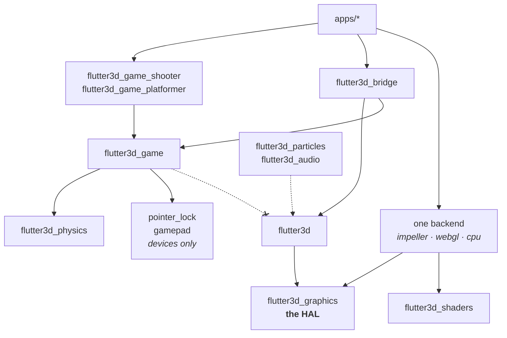

# Package index

Eighteen packages and three applications, resolved as one [pub workspace](https://dart.dev/tools/pub/workspaces), so a single `flutter pub get` covers everything against one lock file.

## Engine

### `flutter3d`
The renderer and everything that walks a scene. Import `package:flutter3d/flutter3d.dart`; it re-exports the graphics vocabulary, because a `Material` holds a `SamplerOptions` and a consumer should not need a second dependency to spell the type of something this package handed them.

Depends on `flutter3d_graphics` and nothing below it. **Does not** re-export a backend, an application picks one by name, and that choice stays visible in its pubspec.

→ [The frame](/core/rendering/) · [Scene graph](/core/scene/) · [Geometry](/core/geometry/) · [Assets](/core/assets/)

### `flutter3d_graphics` — the HAL
The hardware abstraction layer, and the vocabulary a backend implements: `GraphicsDevice`, `CommandEncoder`, `PassState`, `TextureHandle`, `GeometryBuffer`, samplers, formats, vertex layout specs, a render target pool. **No implementation at all.** Two rules, both checked: no `flutter_gpu` import ever, and no `dart:ui` apart from one member on `GraphicsDevice` that has to name it.

When a second backend arrives, this package does not change. A translation file appears in the new backend, and that is all.

→ [The HAL and its three backends](/core/architecture/#the-hal) · [Writing a backend](/core/backends/)

### `flutter3d_shaders`
The shared GLSL every backend compiles from — Impeller into a bundle, WebGL by translation, the CPU backend as Dart transcriptions.

## Backends, three implementations of the HAL

An application depends on exactly one of these by name, and that dependency is the only place the choice is visible.

### `flutter3d_impeller` — flutter_gpu
`flutter_gpu` over Metal on Apple platforms and Vulkan elsewhere. The production backend, and the only one the two games run on. Ships `tool/build_shaders.sh`, which calls `impellerc` directly and prints the compiled binding table. `GpuRenderBackend.create()` is the entry point, and nothing else in the stack names `flutter_gpu`.

### `flutter3d_webgl` — WebGL2
The browser. `WebGlDevice` implements the HAL and has its own example.

Its real value is not that it runs on the web: it is the first thing that can tell you whether the HAL is a *seam* or a *description of Impeller*, because a fake backend can only confirm that an interface is callable, never that it is implementable.

**Status:** complete enough to run both games. `lib/engine_shaders.dart` holds all twenty-six entry points in GLSL ES 3.00, generated from `flutter3d_shaders` by `tool/generate_shaders.dart`.

The library docstring still says the shaders are unwritten, which is out of date. What is true is that nothing checks the generated file against its source, so it goes stale silently: when cascaded shadows added a member to a uniform block, the backend stopped drawing anything until the generator was re-run. See the [platformer demo](/platformer/demo/#the-bug-this-demo-found).

### `flutter3d_cpu` — software
A rasteriser written in Dart. `CpuDevice` implements the same HAL, plus PNG output and Dart transcriptions of the shaders.

Not a fallback. Two hardware backends agreeing proves less than it looks like: both are driven by a C API and both rasterise on a GPU, so an assumption shared by graphics hardware would be invisible to the pair of them. This one shares nothing with either, no driver, no shading language, no command buffer.

It is how thirty golden scenes are checkable with no GPU in the room, and it is a dev dependency of both games because three shipped bugs would have been caught by rendering a single frame in a test.

### `flutter3d_conformance`
The suite any fourth backend would have to pass before it counted as one, plus the cross-backend comparison with per-scene budgets. Deliberately shader-free, so a backend can run it before it has a single shader compiled.

→ [Writing a HAL backend](/core/backends/)

## Simulation

### `flutter3d_game`
The game layer: `FixedStep`, `GameLoop`, `InputState`, the `Level` format and its validator, `EntityKind` and the registry, mechanisms and movers, `Actor` / `Brain` / `ActorSystem`, the navigation grid and flow fields, `EcsWorld`, `Snapshot`, `GameRandom`.

Imports Flutter in exactly one file, because a key event is a Flutter type. Re-exports `flutter3d_physics`, so a game gets a working world from one import.

→ [Simulation layer](/core/simulation/)

### `flutter3d_physics`
Collision shapes, a uniform-grid broadphase, sweeps and rays that do not tunnel, `CharacterController`, `Dynamics` and `RigidBody`. Plain Dart, no Flutter, no renderer, runs under `dart test`.

→ [Collision & physics](/core/physics/)

## Genres

### `flutter3d_game_shooter`
Weapons, an arsenal, hitscan, projectiles and blasts, monsters with a six-state brain, an inventory, gifts and pickups, and `GameSimulation`, a shooter's step order.

Three barrels: `flutter3d_game_shooter.dart` (nothing imports the renderer), `bridge.dart` (`WeaponView`, which does), and `sample.dart` (this repository's own roster, so the package itself ships no content).

→ [What a shooter adds](/shooter/) · [Tutorial](/shooter/tutorial/)

### `flutter3d_game_platformer`
`Runner` and `RunnerTuning`, `Surfaces`, `Purse`, collectibles, checkpoints, hazards, springs, one-way platforms, conveyors, crumbling and breakable blocks, climbables, crates, `Patrol` and `Leaper` enemies, `FollowCamera`, and `PlatformerSimulation`.

Nothing here imports the renderer, so all of it runs in a test with no device.

→ [What a platformer adds](/platformer/) · [Tutorial](/platformer/tutorial/)

## Where the halves meet

### `flutter3d_bridge`
The only package allowed to depend on both sides. `LevelLoader` (a document becomes a scene *and* a collision world), `ActorVisuals`, `FixtureVisuals`, `SharedMeshes`. Everything in it is mechanism; what a torch looks like arrives through `FixtureAppearance` and `ActorAppearance`.

## Extensions

### `flutter3d_particles`
One pool for the whole application, one draw call, plugged in through `PassContributor`. Emitters, affectors, curves and gradients, flipbooks, mesh particles, and `ParticleGlow` — the light a fire casts, measured from the fire's own particles.

### `flutter3d_audio`
Positional audio: attenuation curves, panning, occlusion through a callback, voice limiting, buses. `SilentBackend` and `SoLoudBackend`, so a machine with no audio device still plays the game.

→ [Particles & audio](/core/extras/)

### `pointer_lock`
Relative mouse deltas, which Flutter offers on no desktop platform. On macOS it turns off the association between the physical mouse and the on-screen cursor, so `mouseMoved` events keep arriving with their deltas while the cursor stays put.

### `gamepad`
Sticks, triggers and buttons, read as a snapshot the caller asks for once per frame — not a stream, because a fixed-step simulation asks *what is the pad doing now* and a stream would push edge detection into every caller. The dead zone is radial and rescaled, applied on the way out so nobody can forget it.

Button names are **physical positions** (`face.south`, not `a`), because the string lands in a player's config file and is read back years later, possibly on a different pad: Xbox's lower face button is `A`, PlayStation's is Cross, and Nintendo swaps `A` and `B`.

Knows nothing about games. The translation into actions is `PadInput` in `flutter3d_game`, beside the keyboard's. The web backend is pure Dart over `navigator.getGamepads()`; macOS, iOS and Android wait for a controller in hand, for the reason `docs/SPEC.md` §4.6 records.

### `flutter3d_ui`
The screens a game has that are not the game: a settings panel with volumes, gamepad and accessibility sliders, a rebinding list that takes a key or a pad button, and where a licence's attribution goes. Nothing here draws a frame or steps a simulation.

Extracted when the second game wanted it, which is this repository's habit rather than a new rule — `CameraRig` says the same about itself. What triggered it was accessibility: rebinding a control is the accommodation that matters most, and the alternative was four hundred lines of panel copied into the second game.

## Applications

### `apps/dungeon`
The shooter, and a headless test that plays it to the exit.

### `apps/platformer`
The platformer: third person, two jumps and a dash, and no line of the engine changed to allow it. Short enough to read in one sitting, which the dungeon's 898 lines are not.

### `packages/flutter3d/example`
The engine's own demo: a model browser with every feature switchable, and the frame-capture hook.

## Dependency rules, in one picture

The dashed crossed edge is the rule that pays: `flutter3d_game` must never reach the renderer, and `test/no_genre_test.dart` plus `backend_is_contained_test.dart` are what make it a fact instead of an intention.
