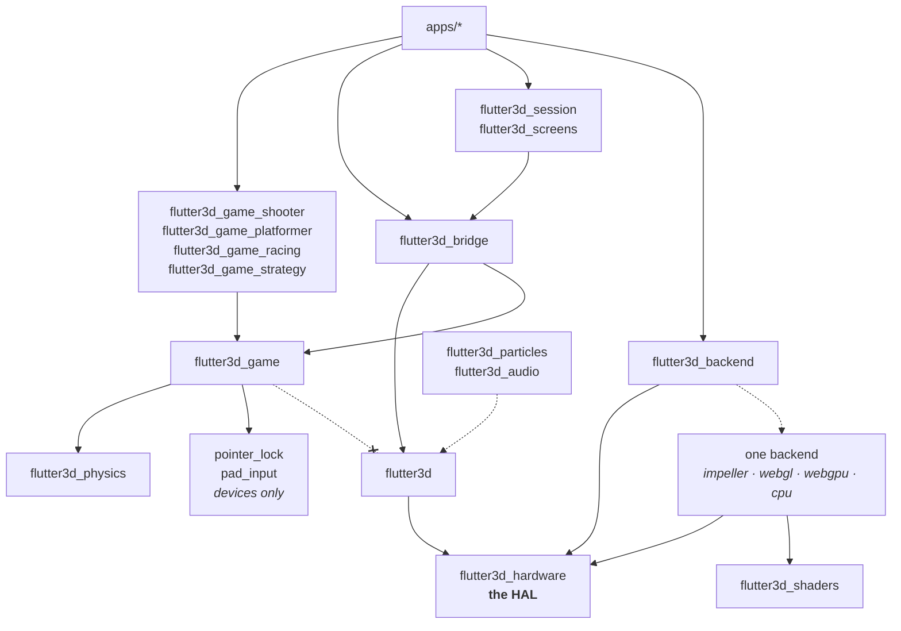

# Package index

Thirty-three packages and seven applications, resolved as one [pub workspace](https://dart.dev/tools/pub/workspaces), so a single `flutter pub get` covers everything against one lock file. Twenty-seven of the packages are on pub.dev at the 0.6.0 set — `pad_input` and `pointer_lock` on a line of their own at 0.4.1, `flutter3d_samples` on its at 0.4.2. `flutter3d_game_strategy` is the one that lives in this checkout only, because its types still encode how many sides a match may have.

## Engine

### `flutter3d`
The renderer and everything that walks a scene. Import `package:flutter3d/flutter3d.dart`; it re-exports the graphics vocabulary, because a `Material` holds a `SamplerOptions` and a consumer should not need a second dependency to spell the type of something this package handed them.

Depends on `flutter3d_hardware` and nothing below it. **Does not** re-export a backend, an application picks one by name, and that choice stays visible in its pubspec.

→ [The frame](/core/rendering/) · [Scene graph](/core/scene/) · [Geometry](/core/geometry/) · [Assets](/core/assets/)

### `flutter3d_geometry` — the mesh, with no Flutter behind it
`VertexLayout`, `MeshData`, `MeshBuilder`, the shape generators a scene is sketched from, `MeshGeometry` and `CpuMesh`, tangents by Lengyel, morph targets and `MorphTexture`, and `Ray` with the intersection arithmetic that reads a triangle. Import `package:flutter3d_geometry/flutter3d_geometry.dart`, or take it through `flutter3d`, which exports it whole.

It left the engine because `flutter3d` declares `flutter: sdk`: every file here named Flutter nowhere, and it bought nobody anything, since a package that depended on the engine to say `MeshData` resolved a Flutter SDK it had no use for and `dart pub get` in a container without one failed. `DeviceMesh` stayed behind with the types that have met a `GraphicsDevice` — that is the line the split was made along, and the only one.

→ [Geometry](/core/geometry/)

### `flutter3d_formats` — what a model arrives in
`ModelDocument` and everything a decoder fills in, `SurfaceMaterial`, `MaterialDocument`, `LightingModel`, `AnimationClip` and `AnimationTrack`, and the readers for glTF/GLB, OBJ, the engine's own `.f3d` container and its `.fmat`. Import `package:flutter3d_formats/flutter3d_formats.dart`, or take it through `flutter3d`.

The split with the engine is at the bytes: this package turns bytes into a document, and `flutter3d` is what fetches them and uploads the result. So `decodeModelInIsolate` with its `kIsWeb`, `BundleAssetSource` and `FileAssetSource`, the bundle resolvers, and everything naming a `GraphicsDevice` — `ModelAsset`, `ModelPart`, texture upload, the KTX2 reader — all stayed behind. `AssetSource` itself is here, as the abstraction both sources extend.

→ [Assets](/core/assets/)

### `flutter3d_hardware` — the HAL
The hardware abstraction layer, and the vocabulary a backend implements: `GraphicsDevice`, `CommandEncoder`, `PassState`, `TextureHandle`, `GeometryBuffer`, samplers, formats, vertex layout specs, a render target pool. **No implementation at all.** Two rules, both checked: no `flutter_gpu` import ever, and no `dart:ui` apart from one member on `GraphicsDevice` that has to name it.

When a second backend arrives, this package does not change. A translation file appears in the new backend, and that is all.

→ [The HAL and its four backends](/core/architecture/#the-hal) · [Writing a backend](/core/backends/)

### `flutter3d_shaders`
The shared GLSL every backend comes from: Impeller compiles it into a bundle, WebGL translates it, WebGPU translates it down a second toolchain into WGSL, and the CPU backend transcribes it into Dart by hand. Only the first three are machines reading the text, which is what decides who can witness a GLSL edit: a software golden set that matched byte for byte says nothing about one, because those shaders were rewritten by a person, and `flutter3d_cpu`'s own files say so at the head.

## Backends, four implementations of the HAL

An application depends on exactly one of these by name, and that dependency is the only place the choice is visible.

### `flutter3d_impeller` — flutter_gpu
`flutter_gpu` over Metal on Apple platforms and Vulkan elsewhere. The production backend, and the only one all three games run on. Ships `tool/build_shaders.sh`, which calls `impellerc` directly and prints the compiled binding table. `GpuRenderBackend.create()` is the entry point, and nothing else in the stack names `flutter_gpu`.

### `flutter3d_webgl` — WebGL2
The browser. `WebGlDevice` implements the HAL and has its own example.

Its real value is not that it runs on the web: it is the first thing that can tell you whether the HAL is a *seam* or a *description of Impeller*, because a fake backend can only confirm that an interface is callable, never that it is implementable.

**Status:** all three games run on it. `lib/engine_shaders.dart` holds every entry point in GLSL ES 3.00, generated from `flutter3d_shaders` by `tool/generate_shaders.dart`, and CI regenerates it and fails on the diff — it used to go stale silently, and when cascaded shadows added a member to a uniform block the backend stopped drawing anything until somebody re-ran the generator. See the [platformer demo](/platformer/demo/#the-bug-this-demo-found).

### `flutter3d_webgpu` — WebGPU
The second browser backend. `openWebGpu` asks for an adapter and then a device, answers null where a browser has neither, and turns that null into the one `StateError` worth putting on a screen. Two barrels: `flutter3d_webgpu.dart` is pure Dart — the translation table and the pipeline signature, asserted on the VM in about a second — and `flutter3d_webgpu_web.dart` is everything that reaches for `dart:js_interop`.

It is the first backend whose shaders are not the same text the others read, and that is why it exists as a separate question rather than as a second browser option. WGSL is a different language and no browser takes SPIR-V, so `tool/generate_shaders.dart` runs the same manifest through `glslangValidator` and then `naga --keep-coordinate-space`, and CI regenerates the table and fails on the diff. All thirty-nine stages compile.

**What it declines, by name rather than by silence:** the blend constant, because WebGPU has `"constant"` and `"one-minus-constant"` and no colour/alpha split for `BlendFactor.blendAlpha`; and wireframe, because the API has no polygon fill mode. Those two are how the conformance suite comes back 33 of 33 with two honest refusals in it. Block compression left that list when the device started asking the adapter which of `texture-compression-bc`, `-etc2` and `-astc` it carries and requesting exactly those — asking for one it lacks rejects the device outright, which is why the intersection is taken and why the capability answers from what was *granted*. Three formats stay refused whatever the adapter: `a8UNormInt` and the two HDR ASTC layouts have no WebGPU spelling at all.

**Status:** it draws, and its conformance run is an ordinary test file, because Chrome has a real WebGPU device inside `flutter test` — the one thing this backend gets that Impeller cannot. Not published yet, and not what a browser build opens by default: `--dart-define=FLUTTER3D_WEBGPU=true` is the ask, and it is off because a build that can try both ships both — 376,649 bytes of `main.dart.js` on the strategy demo, 14.9%, measured rather than guessed.

### `flutter3d_cpu` — software
A rasteriser written in Dart. `CpuDevice` implements the same HAL, plus PNG output and Dart transcriptions of the shaders.

Not a fallback. Two hardware backends agreeing proves less than it looks like: both are driven by a C API and both rasterise on a GPU, so an assumption shared by graphics hardware would be invisible to the pair of them. This one shares nothing with either, no driver, no shading language, no command buffer.

It is how forty-three golden scenes are checkable with no GPU in the room, and it is a dev dependency of every game because three shipped bugs would have been caught by rendering a single frame in a test. It stopped being *only* a dev dependency once `flutter3d_backend` started reaching for it as the runtime fallback when Impeller will not start — a real, if last-resort, production path now, not just a test one.

### `flutter3d_conformance`
The suite any fourth backend would have to pass before it counted as one, plus the cross-backend comparison with per-scene budgets.

Two tiers, and the split is a correction. The library said it was shader-free as a whole, and that stopped being true the day a check needed a pipeline: twenty-five of the thirty-three link stages and draw. `coreChecks` is what runs on clears, uploads and readback alone, so a backend can ask it before compiling a single shader; `shaderChecks` is the rest. A backend that believed the old promise would have met every one of those failures with nothing it could do about them yet — and the phrasing here is the one `tool/structure.dart` holds to the lists themselves, so the sentence cannot go stale again without the scan saying so.

→ [Writing a HAL backend](/core/backends/)

### `flutter3d_testing`
Renders a scene through the software backend and compares it against a reference image, so a game built on the engine gets pixel regression tests on a machine with no display.

Two calls: `renderFrame` builds a frame from a scene and a camera, `expectMatchesGolden` compares it against a PNG and records one when there is none. The tolerance defaults to **zero**, and that is the point. A software rasteriser has no driver, no clock and no thread to disagree with itself, so the same scene drawn twice is the same bytes twice; a package telling its users to allow "a few pixels" would be telling them to stop watching.

## Simulation

### `flutter3d_sim`
The simulation: `FixedStep`, `GameLoop`, `InputState` and `InputTape`, the `Level` format and its validator, `Breaches` for the holes a blast leaves in it, `LevelVisibility` and the `bake_visibility` tool that writes one, `Lightmap`, its layout and the `bake_lightmap` baker, `EntityKind` and the registry, mechanisms and movers, `Actor` / `Brain` / `ActorSystem`, the navigation grid, its flow fields and jump links and the `Automap` drawn from them, `EcsWorld`, `Snapshot`, `Demo`, `RewindBuffer`, `GameRandom`, `StateDigest`.

**Plain Dart. No Flutter anywhere, and a scan says so** — `the simulation names no Flutter` reads its `lib/`, `test/` and `bin/`. The whole suite runs under `dart test`, and `dart run flutter3d_sim:headless_run` walks a body through the shipped crypt level with no Flutter SDK installed.

That is not tidiness. A server that verifies a submitted run has to replay it through the same simulation the player ran — a second copy of the game logic on the server proves nothing about the first — and that server is a Dart process in a container.

→ [Simulation layer](/core/simulation/)

### `flutter3d_game`
What was left when the simulation moved out: the touch stick, the touch button and the controls that lay them out, keyboard and mouse, the accessibility settings that read a `MediaQuery`, and the diagnostics sink. Eight files that wanted Flutter, out of the eighty-nine this package used to hold.

Re-exports the whole of `flutter3d_sim` and `flutter3d_physics` through it, so a game that imported this one keeps working unchanged.

### `flutter3d_physics`
Collision shapes, a uniform-grid broadphase, sweeps and rays that do not tunnel, `CharacterController`, `Dynamics` and `RigidBody`. Plain Dart, no Flutter, no renderer, runs under `dart test`.

→ [Collision & physics](/core/physics/)

## Genres

### `flutter3d_game_shooter`
Weapons, an arsenal, hitscan, projectiles and blasts, monsters with a six-state brain, an inventory, gifts and pickups, and `GameSimulation`, a shooter's step order.

Three barrels: `flutter3d_game_shooter.dart` (nothing imports the renderer), `bridge.dart` (`WeaponView`, which does), and `sample.dart` (this repository's own roster, so the package itself ships no content).

→ [What a shooter adds](/shooter/) · [Tutorial](/shooter/tutorial/)

### `flutter3d_game_platformer`
`Runner` and `RunnerTuning`, `Surfaces`, `Purse`, collectibles, checkpoints, hazards, springs, one-way platforms, conveyors, crumbling and breakable blocks, climbables, crates, `Patrol`, `Leaper` and `Hunter` enemies, `FollowCamera`, and `PlatformerSimulation`.

Nothing here imports the renderer, so all of it runs in a test with no device.

→ [What a platformer adds](/platformer/) · [Tutorial](/platformer/tutorial/)

### `flutter3d_game_racing`
A car, a road that is a curve instead of a floor, and a lap that only counts when it was driven all the way round. `TrackSpline` and `TrackField` place a car by where it is on the curve instead of sweeping it against geometry, so a circuit can run to a kilometre. `SphereVehicle` and `TireModel` are the car; `RaceState` and `RacingSimulation` own laps, checkpoints and positions; `AiDriver` races against it and `GhostRecorder`/`GhostTape`/`GhostPlayer` record a lap as places rather than inputs, so it survives the car being retuned.

Draws nothing, for the same reason the other two genres don't: a car that understeers differently at a lower frame rate, or a lap counted twice in one step, appears nowhere in a screenshot and is reachable from a plain test.

→ [What a racing game adds](/racing/) · [Tutorial](/racing/tutorial/)

### `flutter3d_game_strategy`
A camera over a map, orders given to a selection, and a crowd instead of a hero — the first genre here that is not one body under a camera bolted to it. A `Heightfield` of samples is the ground everything stands on, and `MapCamera` looks down at it; `StrategyOrder` is sealed over `MoveOrder`, `AssignOrder`, `AttackOrder` and `TrainOrder`, and a `UnitOrder` carries a goal, a formation and, when there is one, a target; `Formation`, `Squad` and a flow field shared by destination are how a crowd descends on the same place without a path apiece; `UnitType` is a row of numbers, so a worker, a soldier and a tank differ in what they measure rather than in what runs; `ResourceNode`, `HarvestJob`, `Stockpile`, `Producer`, `Building` and `Bot` give a side something to spend and a policy that plays it without a mouse; `FogOfWar` keeps what a side has explored apart from what it can see right now; `Match` and `MatchGoal` own the two ways to win; and `OrderTape` writes a whole match down as the orders that produced it.

Two probes ran before any of it was written, and both moved the design. Ten thousand agents step in under a millisecond and fifty thousand instanced units hold the display's refresh rate — so neither the crowd nor the draw call is the constraint, and what follows is that separation applies to *everybody* rather than to what a camera can see (limiting it saves 717 microseconds and costs a run that replays the same way twice) and that the navigation grid is two metres rather than the quarter a shooter bakes.

It is what finally exercised three things the engine had built and no game had used: `InstancedMeshNode`, the picking pass, and the flow fields in `flutter3d_sim`'s navigation.

## Where the halves meet

### `flutter3d_bridge`
The only package allowed to depend on both sides. `LevelLoader` (a document becomes a scene *and* a collision world, and its `rebuildBrushes` draws the walls again after a breach), `VisibilityCuller` (the visibility table applied to the batches once a frame), `SoundOcclusion` (the walls between a sound and the ear, as a gain and a muffle), `ActorVisuals`, `FixtureVisuals`, `SharedMeshes`. Everything in it is mechanism; what a torch looks like arrives through `FixtureAppearance` and `ActorAppearance`.

## Keeping the rules

There is no package for this. The rules about how the repository is arranged (which package may name a genre, which file may reach a renderer, where a `static final Vector3` may not be) live in `tool/structure.dart` and run before a build:

```bash
dart run tool/structure.dart
```

Thirty-one rules, under a second, no `pub get` and no device: every one of them reads source text. They were a `boundaries_test.dart` in each package until thirteen packages of twenty-one turned out to have none, all thirteen clean and not one of them checked. A runner that walks `packages/` covers a package the day it exists.

The detectors prove they fire before a single file is scanned, and a broken detector stops the run rather than letting thirty-one green scans be reported behind it. See [Testing](/reference/testing/).

## Assembling an application

Three packages exist because the same wiring was written out, close to identically, in three `main.dart` files. A fourth is a barrel over them.

### `flutter3d_app`
One import for the assembly layer:

```dart
import 'package:flutter3d_app/flutter3d_app.dart';

final device = await openDevice(width: 1280, height: 720);
```

Thirty-five lines, all of them `export`. It re-exports `flutter3d_backend`, `flutter3d_session`, `flutter3d_screens`, `pad_input` and `pointer_lock`. None of those know about each other, and this does not change that. What it buys is that an application says "the assembly layer" once, the way importing `flutter3d` says "the renderer" once instead of naming `flutter3d_hardware`.

Deliberately **not** behind it: `flutter3d`, `flutter3d_bridge`, `flutter3d_game` and a genre package. Those are content, meaning what a scene looks like and what kind of game this is, and a facade cannot choose a genre on an application's behalf.

Six of the seven applications import it — the four games, the template and the modeller, which reaches `openDevice` through it in one exported line. `flutter3d_editor` is the one that does not, and that is a gap rather than a second pattern: see [Assembling an application](/core/session/).

### `flutter3d_backend`
Which graphics backend a build draws through: `openDevice({required width, required height})` returns a `GraphicsDevice`. **Three decisions, made three different ways.** Web or native is a conditional export, picked at compile time, because `flutter_gpu` does not compile for the web and `dart:js_interop` does not compile for macOS. On the native half, Impeller or software is a runtime `try`/`catch` instead: `GpuRenderBackend.create()` is tried first, and a throw — Flutter GPU refusing to start on Skia, or a platform where Impeller was never enabled — falls back to `flutter3d_cpu`'s `CpuDevice`, since `flutter_gpu` ships with the SDK and no compile-time check can see whether it will actually start. On the browser half, WebGPU or WebGL2 is the same shape of `try`/`catch` — `navigator.gpu` may be absent, or present and hand out no adapter on a blocklisted driver, and no `dart.library.*` check sees either — but it is reached only behind `--dart-define=FLUTTER3D_WEBGPU=true`, because a probe that can call both openers keeps both backends reachable and dart2js ships what it can reach: 376,649 bytes of `main.dart.js` on the strategy demo, 14.9%, measured on two builds of the same checkout. Deliberately does not decide resolution or shadow budget — `kFixedResolution` reports whether the *primary* backend renders to a fixed internal target, and the size stays the application's own choice.

Kept out of `flutter3d_session`, which would otherwise have to depend on both backends and drag WebGL into `apps/flutter3d_editor`, which has no browser build to choose for.

### `flutter3d_session`
The seam a rendered frame reaches Flutter through, and the run being played — neither the simulation nor the screens, so it belongs to neither `flutter3d_bridge` nor `flutter3d_screens`. `SceneSurface` is the widget that hands a frame to Flutter, with its `RenderSettings` read from a function called once per frame rather than stored, so anything derived from the camera is derived after it moved. `RunSession<L>` is loading a level, restarting it, moving to the next, saving, resuming, and reporting how a run ended — an ordinary class that two of the three games wrap in a cubit, which the package neither knows nor requires. `FrameClock` is how long since the last frame, measured on the wall clock rather than read off the ticker: five applications had written that out, three said a sixtieth of a second on the first frame and one said nought, and a ticker's timestamp is the vsync a frame was aimed at, which steps in pairs when the GPU falls behind.

`test/one_assembly_test.dart` checks the rule this package exists to keep: exactly one function per game turns a level document into a run. The platformer had six copies of that assembly before extraction, and they had drifted.

→ [Assembling an application](/core/session/)

### `flutter3d_screens`
The screens a game has that are not the game: a settings panel with volumes, gamepad and accessibility sliders, a rebinding list that takes a key or a pad button, `AutomapView` for what an `Automap` has seen, and where a licence's attribution goes. Nothing here draws a frame or steps a simulation.

Extracted when the second game wanted it, which is this repository's habit rather than a new rule — `CameraRig` says the same about itself. What triggered it was accessibility: rebinding a control is the accommodation that matters most, and the alternative was four hundred lines of panel copied into the second game. A second entry point, `package:flutter3d_screens/native.dart`, holds the one piece that needs a filesystem (an atomic document write), kept off the main barrel so a `dart:io` import never stops a web build compiling.

## Extensions

### `flutter3d_particles`
One pool for the whole application, one draw call, plugged in through `PassContributor`. Emitters, affectors, curves and gradients, flipbooks, mesh particles, and `ParticleGlow` — the light a fire casts, measured from the fire's own particles.

### `flutter3d_audio`
Positional audio: attenuation curves, panning, occlusion through a callback, voice limiting, buses. `SilentBackend` and `SoLoudBackend`, so a machine with no audio device still plays the game.

→ [Particles & audio](/core/extras/)

### `pointer_lock`
Relative mouse deltas, which Flutter offers on no desktop platform and does not surface in a browser either. On macOS it turns off the association between the physical mouse and the on-screen cursor, so `mouseMoved` events keep arriving with their deltas while the cursor stays put. In a browser it is `document.requestPointerLock` through static interop — pure Dart, chosen by conditional export, so nothing is registered and `flutter test --platform chrome` can exercise it. Windows and Linux are not implemented, and now say so: a game reads `isSupported` and turns the camera by dragging instead, which it could not do while the answer was a platform list in the game.

Three things a browser does that a desktop does not, all handled: a capture must come out of a user gesture, a refusal arrives as an event rather than as an exception, and the player can leave the lock with Escape at any moment.

### `flutter3d_samples`
The Khronos glTF sample assets, the Utah teapot and the `.f3d` conversions of them. Test data with two path constants over it — `kSamplesAsset` for a bundle, `kSamplesPath` for disk — and no other Dart.

Its own package because it was `flutter3d`'s: declared in the engine's `flutter.assets`, so every application built on the engine bundled 4.1 MB of models it never loads, a third of the shooter's web asset payload. The decoder tests and the demo still read them; a game no longer carries them.

### `pad_input`
Sticks, triggers and buttons, read as a snapshot the caller asks for once per frame — not a stream, because a fixed-step simulation asks *what is the pad doing now* and a stream would push edge detection into every caller. The dead zone is radial and rescaled, applied on the way out so nobody can forget it. The entry point is `Gamepad.instance` and a `PadSnapshot`.

Button names are **physical positions** (`face.south`, not `a`), because the string lands in a player's config file and is read back years later, possibly on a different pad: Xbox's lower face button is `A`, PlayStation's is Cross, and Nintendo swaps `A` and `B`.

Knows nothing about games. The translation into actions is `PadInput` in `flutter3d_game`, beside the keyboard's. The web backend is pure Dart over `navigator.getGamepads()`; macOS, iOS and Android wait for a controller in hand, for the reason `ARCHITECTURE.md` §11.1 records. Windows and Linux are not implemented yet.

## Tools

### `flutter3d_editor_core`
A level editor with the editor taken out. `Editing` (select, nudge, grow, add, duplicate, turn, brighten, delete, set a field, undo, redo, and write the document back exactly as it was written), `Handle` and `handlesOf`, `Picking` (a ray against the brushes, and a tie broken towards the thing standing against the wall rather than the wall), `Placeable` and the palette a level builds out of itself, `Looks` (what a game says its own words look like), `OpenKind`, and `Template` / `scaffold` / `projectAt` — a new project as a map of bytes.

**Plain Dart, held by the same scan the simulation is** — `the simulation names no Flutter` reads a list of packages now, and this is the second one on it. `dart test` runs the suite with no binding.

It was eight files of `apps/flutter3d_editor/lib/src`, and moving them was not tidiness: `no package depends on an application` forbids anything depending on an application, and pub cannot express such a dependency anyway, because an application is not published. So a level linter for CI, a service that validates an uploaded level before a player loads it, or a tool an agent speaks to had nowhere to start. A level is a document, and the programs that most want to say a document is wrong are the ones with nothing to draw.

It does not draw, does not read a disk, and knows no genre. Two files stayed with the application and say where the line is: the fly camera needs a renderer to have a camera, and reading a file off a disk is where a crash loses somebody's work.

→ [The level editor](/core/editor/)

### `flutter3d_editor_mcp`
The same editor, offered to an agent. A [Model Context Protocol](https://modelcontextprotocol.io) server over stdio — `dart run flutter3d_editor_mcp:editor_mcp <level.json>` — holding one document for the life of one process.

**The tools are `EditorCommand`, not a second implementation of one.** Ten of the seventeen are the sealed hierarchy `flutter3d_editor_core` already publishes, offered under the names that package already gives them, and a tool call is its arguments handed to `EditorCommand.fromJson`. So an edit made by an agent and an edit made by a hand reach the document by one route, get one name in the undo stack, and come back under the same key. The table is built from `editorCommandNames` and the suite holds it to that list both ways round, because a server keeping its own copy is a server that silently cannot call the eleventh command.

**Two of the tools are not commands, and both were missing from every sketch of this.** `list` prints everything in the level with the kind and index `select` takes — every other verb works on "the selection", which a program with no screen cannot guess, so without it driving the editor means moving the third brush without ever finding out there is a third brush. It lives in the core package as `contentsOf`, beside `handlesOf`, because it is the same question asked by a caller with no pixels. `validate` runs the document through `LevelValidator` against its own vocabulary; without it the first news of a broken level is a diff somebody reads later.

**It cannot draw, and says so.** `screenshot` is declared and refuses with the reason: every backend here reaches a `GraphicsDevice` whose finished frame is a Flutter widget, so a process that can render a level is a Flutter process — and `dart run` cannot resolve a package that depends on the Flutter SDK. An absent tool reads as an incomplete server; a refusal with a reason ends the question.

**And it will not write over a generated document.** A level carrying `generatedBy` may be opened, changed and saved somewhere else, and the copy claims itself. Saving over the original is refused, because that save would look like it worked right up until the next run of the generator threw the work away.

Plain Dart, held by the same scan the simulation and the editor's core are: no Flutter anywhere in the graph, which for this package is not tidiness but whether the server starts at all.

### `flutter3d_mesh`
The mesh a modeller edits, with the topology still in it: faces of any valency, half-edges that know their twin, attribute layers, and the operations that change them. Plain Dart.

It exists because `MeshData` is the wrong shape for editing. That one describes a finished mesh — vertices in the order a GPU wants them, a corner duplicated once per face normal meeting there — and every question a modeller asks is about what that arrangement threw away: which faces share this edge, what ring does it belong to, what is the loop around this face.

**A spike today, and its own header says so.** `EditMesh` builds from faces or as a cuboid, walks loops without allocating, extrudes a face, validates its invariants and converts to `MeshData`; operations rebuild the arrays rather than editing them in place. What comes next — persistent chunked arrays, selections, loop cuts, dissolves — is `doc/model-editor-plan.md` §2.1.

### `flutter3d_model_core`
The headless half of the model editor: the project, the sealed command every edit is one of, the history that takes them back, and the rules about whether the result can leave. The same split `flutter3d_editor_core` made for levels, for the same reason.

A registered skeleton today. The package exists ahead of its contents so the structure scan, the publishing order and the check that a bare `dart pub get` resolves it all cover the document layer from its first commit.

### `flutter3d_model_mcp`
The modeller offered to an agent, over MCP on stdio, one project per process — the shape `flutter3d_editor_mcp` has for levels.

An entry point and a usage line today; running it says the server is not built yet and exits non-zero. What it already proves is the property everything under it is arranged for: a machine with the Dart SDK and no Flutter can resolve this package and start it, which CI asks in a container of exactly that kind.

## Applications

### `apps/flutter3d_demo_dungeon`
The shooter, and a headless test that plays it to the exit.

### `apps/flutter3d_demo_platformer`
The platformer: third person, two jumps and a dash, and no line of the engine changed to allow it. Short enough to read in one sitting, which the dungeon's 898 lines are not.

### `apps/flutter3d_demo_racing`
An arcade racer: one circuit, a car that can be made to slide, and a lap time to beat. Runs on Impeller and, since the cube shadow atlas got its own resolution, in a browser too — its [demo page](/racing/demo/) keeps the hunt that took it there.

### `apps/flutter3d_demo_strategy`
A map, two sides and a match played to a finish: a camera over the ground, a box drawn round a selection, orders given to it, and an opposing side played by `Bot`. `playthrough_test.dart` plays `assets/levels/map_a.json` to somebody winning it with nothing drawn at all — the balance of a map is what no other test in this repository would notice, and a match is thousands of steps, so a picture per step would be an hour of frames nobody looks at. Builds for macOS, the web, Android and iOS.

### `apps/flutter3d_editor`
The first application here that is not a game: opens a level document with the same `LevelLoader` the games use, and lets somebody fly around it, drag what's in it, and write it back. What it keeps is the half that reaches a device — the window, the disk, the camera, the frame; everything else is `flutter3d_editor_core`. → [The level editor](/core/editor/)

### `apps/flutter3d_template_app`
The application a new project starts as: a level you can walk around, with no genre package. It opens its device through `flutter3d_backend`'s `openDevice` in one exported line, which is what gives a scaffolded project the web build and the software fallback without its author deciding anything — see [Assembling an application](/core/session/).

### `packages/flutter3d/example`
The engine's own demo: a model browser with every feature switchable, and the frame-capture hook.

## Dependency rules, in one picture



The dashed crossed edge is the rule that pays: `flutter3d_game` must never reach the renderer, and the genre and backend rules in `tool/structure.dart` are what make it a fact instead of an intention.
