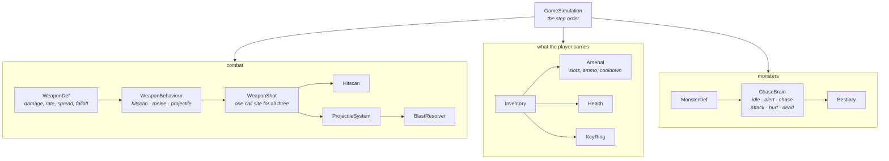
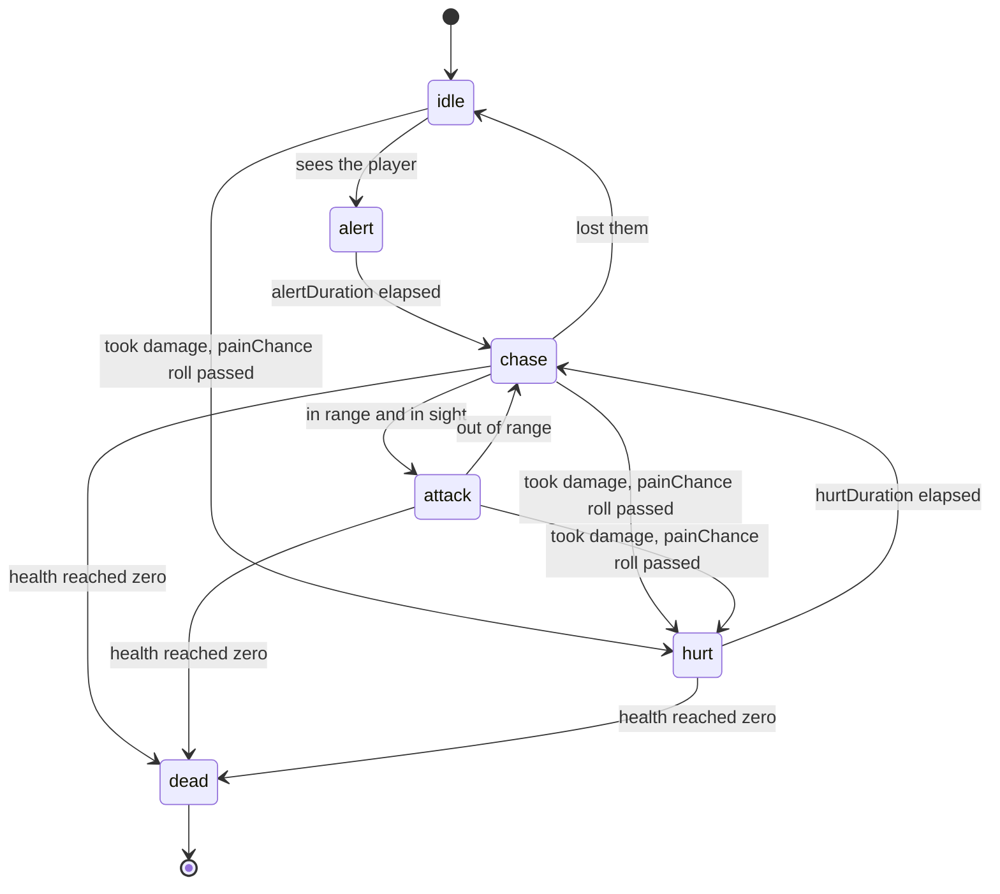

# What a shooter adds

`flutter3d_game` knows what a body, a brain, a mechanism and a step are. What a monster is, what a shotgun does, what a medkit gives, and what order a shooter's step runs in are here. A platformer gets none of it.

The line is the one the game layer already drew: **machinery stays, vocabulary moves.**

| Machinery — stays in core | Vocabulary — lives here |
|---|---|
| `Mechanism`, `Actor`, `ActorSystem` | `Inventory`, `Arsenal`, `Gift` |
| `MechanismEvents.taken`, the level format | `Pickup`, `PickupKind`, `KeyKind`, `NoteKind` |
| `Brain`, `Mind`, navigation | `ChaseBrain`, `MonsterDef`, `Bestiary` |
| `CharacterController`, `CollisionWorld` | `Player`, `WeaponDef`, `WeaponShot` |
| `FixedStep`, `Snapshot` | `GameSimulation` — the step *order* |

Nothing here imports the renderer. `WeaponView` does, and it lives in `bridge.dart` for that reason; a test holds the split.

## The pieces



## Weapons

A `WeaponDef` is a value. Everything about how a weapon feels is a number in one of these, and a game's whole arsenal is a `const` list.

```dart
static const WeaponDef shotgun = WeaponDef(
  name: 'Shotgun',
  behaviour: HitscanBehaviour(),
  ammo: AmmoType.shells,
  damage: 11.0,            // per pellet
  shotsPerSecond: 1.4,
  rayCount: 8,             // eight pellets
  spread: 0.10,
  range: 60.0,
  falloffStart: 6.0,       // full damage up to here
  falloffEnd: 26.0,        // minimumDamageFraction beyond here
  minimumDamageFraction: 0.2,
  knockback: 2.0,
);
```

### Three behaviours, one call site

`WeaponBehaviour` is sealed, and `WeaponShot` is where all three are delivered from, so a monster's claws and a player's rocket launcher go through the same code.

| Behaviour | What it does |
|---|---|
| `HitscanBehaviour` | `rayCount` rays with `spread`, damage falling off between `falloffStart` and `falloffEnd` |
| `MeleeBehaviour(arcDegrees: 70)` | A sphere sweep in an arc, blocked by geometry |
| `ProjectileBehaviour` | Spawns into `ProjectileSystem` at `projectileSpeed`, detonating with a `Blast` |

```dart
final shot = WeaponShot(world: collision, hitscan: hitscan, projectiles: projectiles);

shot.begin(weapon, origin, aim, shooter: player.body.collider);
weapon.behaviour.deliver(shot);
```

### Falloff is per weapon, not global

```dart
final double dealt = weapon.damageAt(distance);
```

A pistol keeps most of its damage to 70 m; a shotgun is down to a fifth of it by 26 m. That single method is what makes closing the distance a decision.

## The arsenal

```dart
final arsenal = Arsenal(
  slots: Weapons.all,                             // slot n is all[n]
  owned: <WeaponDef>[Weapons.fists, Weapons.pistol],
  ammo: <AmmoType, int>{AmmoType.bullets: 40},
  startingSlot: 0,
);

arsenal.advanceTime(dt);
if (arsenal.wantsToFire(held: input.held(ShooterActions.fire),
                        pressed: input.pressed(ShooterActions.fire))) {
  final WeaponDef? fired = arsenal.fire();   // null if on cooldown or dry
}
arsenal.fallBackIfEmpty();
```

`wantsToFire` takes both the held and pressed states because `automatic` is a property of the weapon: a pistol reads `pressed`, a shotgun reads `held`, and neither call site has to know which.

## The inventory

One object rather than four fields, so a pickup has somewhere to give something to, the HUD has one thing to read, and it can hang off the player's collider, which is how a locked door asks what the body in front of it is holding.

```dart
final inventory = Inventory(arsenal: arsenal, maxArmour: 200.0);

inventory.addArmour(25.0);
inventory.empower('invulnerability', 20.0);
inventory.has('berserk');
inventory.remainingOf('invulnerability');
inventory.damage(18.0);       // armour first, then health
inventory.step(dt);           // power-ups tick down
```

## Gifts

What a pickup gives is a `Gift`, and a game composes its own registry. A hierarchy instead of an enum with a switch, because every job that treats them differently grows its own switch over the same names in a different file, and the switches drift.

```dart
final GiftRegistry gifts = GiftRegistry(<Gift>[
  const HealthGift(),
  const ArmourGift(),
  const AmmoGift('bullets', AmmoType.bullets, defaultAmount: 20.0),
  const AmmoGift('shells', AmmoType.shells, defaultAmount: 8.0),
  const AmmoGift('rockets', AmmoType.rockets, defaultAmount: 4.0),
  const KeyGift(),
  const PowerUpGift('invulnerability', defaultAmount: 20.0),
  const PowerUpGift('berserk', defaultAmount: 30.0),
]);
```

A `Gift` answers two questions: `grantTo(inventory, amount, detail)` — did it do anything, and `announce(amount, detail)` — what does the HUD say. A pickup that grants nothing is refused rather than silently consumed, so walking over a medkit at full health leaves the medkit there.

## Monsters

```dart
static const MonsterDef runner = MonsterDef(
  name: 'runner',
  health: 45.0,
  speed: 5.4,
  radius: 0.35,
  height: 1.7,
  sightRange: 24.0,
  attack: WeaponDef(
    name: 'claws',
    behaviour: MeleeBehaviour(),
    ammo: AmmoType.none,
    damage: 9.0,
    shotsPerSecond: 1.6,
    range: 1.9,
    automatic: true,
  ),
);
```

A monster's attack is a `WeaponDef` — the same type the player's shotgun is. That is what makes a fireball, a claw and a rocket one code path.

### The brain



`alertDuration` is the pause between noticing and moving — the beat that makes a monster look like it decided rather than teleported into motion. `painChance` and `painCooldown` decide whether being shot interrupts what it was doing: a tank flinches 15% of the time and no more often than every 1.4 s, so it keeps coming.

### The bestiary

```dart
final bestiary = Bestiary(
  actors: actors,
  shot: WeaponShot(world: collision, hitscan: hitscan, projectiles: projectiles),
  catalog: Monsters.byName,
);

// The entity kind needs a world to put monsters in, and there is none until
// the level has loaded, so it is attached here rather than at construction.
(kinds[ShooterEntities.monster] as MonsterKind?)?.bestiary = bestiary;
```

## The step order

The part that is easy to get wrong and impossible to see.

```dart
void step(double dt) {
  // 1. read input into a wish direction (a dead player's input moves nothing)
  // 2. mechanisms.step  — doors and lifts move
  // 3. collision.reindex — the broadphase catches up
  // 4. dynamics.step     — crates fall onto where the lift is now
  // 5. player.body.step  — the player sweeps against all of it
  // 6. dynamics.push     — what they shove depends on where they ended up
  // 7. collision.update / clearKinematicDeltas
  // 8. the use key, then mechanisms.publish(), then read the exits
  // 9. inventory.step, then the weapon
  // 10. actors.step, then damage to the player
}
```

<div class="why">
<p>Two of those orderings are under test and the rest are ordering by argument; the code says which. <code>clearKinematicDeltas</code> after <code>body.step</code> is tested. <code>reindex</code> before <code>body.step</code> is not, and does not pretend to be: the narrow phase reads live positions and a broadphase cell is four metres, so a stale index loses a mover only if it left its cell inside one step, which nothing that calls itself a door does.</p>
<p><code>publish()</code> comes after the use key, because the use key can start a door. Publishing before it would report that door a step late, every time.</p>
</div>

## Events, drained after the step

```dart
sim.firedThisStep;        // WeaponDef?, for a muzzle flash and a sound
sim.hits;                 // List<ShotHit> — impact marks
sim.usedThisStep;         // ActivationOutcome? — "it is locked" on the HUD
sim.damageTakenThisStep;  // the red flash
actors.died;              // corpses, a kill counter
actors.hurtThisStep;
projectiles.detonations;  // explosions
mechanisms.events.messages;
```

Lists filled during the step and drained by the caller after it. A `Stream` would deliver *after* the step that produced the event, which is the one property the fixed step exists to protect.

## Ready to build one?

The [shooter tutorial](/shooter/tutorial/) assembles all of this into a playable game in fourteen steps.
